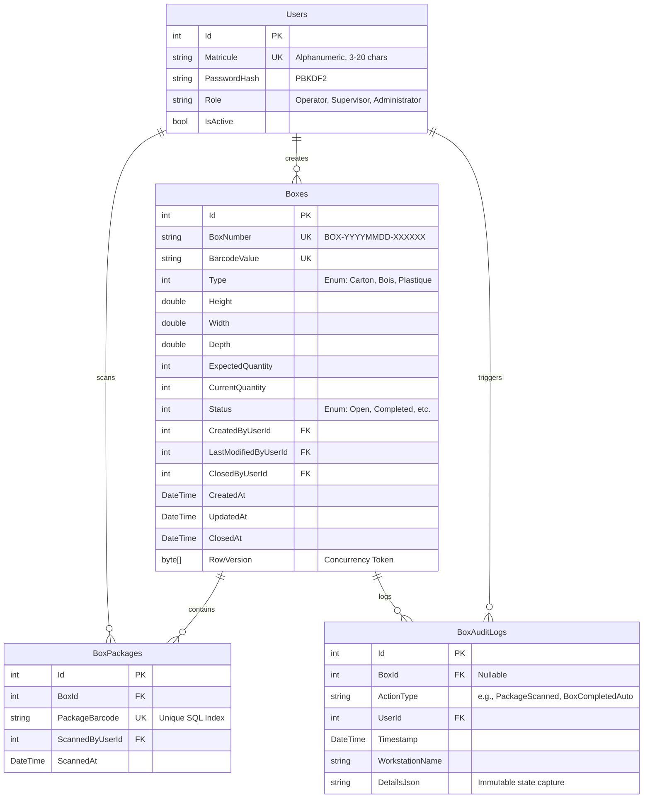

# Phase 1: Database & Authentication - Technical Research

**Researched:** 2026-07-02  
**Status:** Completed  
**Goal:** Answer the question: *"What do I need to know to PLAN this phase well?"*

---

## 1. Core Objectives & Requirements Mapping

Phase 1 establishes the bedrock of the **Motherson Box Management** application. The following requirements must be addressed:

*   **AUTH-01 (Unique matricule login):** Operators, Supervisors, and Admins must be able to log in using their unique matricule and password.
*   **AUTH-02 (Generic error messaging):** Failed login attempts must yield a generic "Invalid matricule or password" message to prevent brute-force enumeration of valid matricules.
*   **AUTH-03 (Role-based access mapping):** Enforce roles (`Operator`, `Supervisor`, `Administrator`) on MVC Controllers.
*   **BOX-05 (Box creator registration and timestamp):** Ensure that the database entities and the authentication system claims are designed to store and propagate the current user's identity context. This guarantees that when box creation is implemented in Phase 2, the creator's matricule can be seamlessly mapped.

---

## 2. Technical Stack & NuGet Dependencies

To align with the project constraints and technology decisions ([STACK.md](file:///.planning/research/STACK.md)), the project will be built with **ASP.NET Core MVC 8.0** and **Entity Framework Core 8.0**.

### Required NuGet Packages
The following dependencies must be added to the web application:
```xml
<ItemGroup>
  <PackageReference Include="Microsoft.EntityFrameworkCore.SqlServer" Version="8.0.0" />
  <PackageReference Include="Microsoft.EntityFrameworkCore.Design" Version="8.0.0">
    <PrivateAssets>all</PrivateAssets>
    <IncludeAssets>runtime; build; native; contentfiles; analyzers; buildtransitive</IncludeAssets>
  </PackageReference>
  <PackageReference Include="Microsoft.AspNetCore.Authentication.Cookies" Version="8.0.0" />
</ItemGroup>
```

---

## 3. Database Schema Design (Entity Framework Core)

A unified relational database schema in SQL Server 2022 is mandated ([ARCHITECTURE.md](file:///.planning/research/ARCHITECTURE.md)). Dynamic table-per-box structures must be avoided.



### Critical SQL Database Constraints (Fluent API Config)
1.  **Global Package Uniqueness (SCAN-03):** To prevent a package from being scanned into multiple boxes, `BoxPackages.PackageBarcode` must have a unique SQL index configured in EF Core Fluent API:
    ```csharp
    builder.Entity<BoxPackage>()
        .HasIndex(bp => bp.PackageBarcode)
        .IsUnique();
    ```
2.  **Optimistic Concurrency on Boxes:** To prevent simultaneous scan operations from corrupting quantity counters, the `Boxes` table must utilize a SQL Server `rowversion` column as a concurrency token:
    ```csharp
    builder.Entity<Box>()
        .Property(b => b.RowVersion)
        .IsRowVersion();
    ```
3.  **Audit Logs Immutability (AUDIT-04):** Audit logs are append-only. No updates or deletions are exposed or supported.

---

## 4. Authentication Architecture

The application will use native **Cookie Authentication** instead of complex ASP.NET Core Identity.

### Session Security Policies (D-05, D-06, D-08)
*   **Cookie Name:** `Motherson.BoxManagement.Auth`
*   **HttpOnly:** `true` (prevents client-side scripts from reading the cookie).
*   **SameSite:** `SameSiteMode.Lax` or `Strict` (guards against CSRF).
*   **SecurePolicy:** `CookieSecurePolicy.SameAsRequest` (allows HTTP testing in local development while supporting HTTPS in production).
*   **Sliding Expiration:** `60 minutes` (automatically renews the cookie lifespan if active).
*   **Session-Only (Non-persistent):** `IsPersistent = false` in `AuthenticationProperties` during sign-in. When the operator closes their browser, the session cookie is immediately destroyed. This prevents session hijacking on shared factory workstation terminals.

### Claim Schema
When a user logs in, the authentication ticket must store:
*   `ClaimTypes.Name` / `ClaimTypes.NameIdentifier`: The unique user ID or Matricule.
*   `ClaimTypes.Role`: The user's role (`Operator`, `Supervisor`, `Administrator`) to drive MVC `[Authorize(Roles = "...")]` filters.
*   Custom claims (e.g. `Matricule`): Stores the clean employee ID string.

---

## 5. Local Environment Diagnostics & Gaps

Before planning the implementation, the developer workspace environment was audited:

### ⚠️ Gap 1: Missing .NET SDK
*   **Finding:** The local machine has `.NET Host 8.0.25` and the runtimes (`Microsoft.NETCore.App` and `Microsoft.WindowsDesktop.App`) installed, but **no .NET SDK is present**.
*   **Implication:** Compilation (`dotnet build`), dependency resolution (`dotnet restore`), and migrations (`dotnet ef`) will fail until the SDK is installed.
*   **Mitigation:** The phase plan MUST declare installing the **.NET 8.0 SDK** as the very first step.

### ⚠️ Gap 2: Missing Local SQL Server
*   **Finding:** The local system does not run a SQL Server Windows Service, and the command `sqllocaldb` is unavailable.
*   **Implication:** Database connections to LocalDB will fail.
*   **Mitigation:** The system has **Docker 29.5.3** running. The most efficient and reliable path for local development is to run SQL Server 2022 inside a Docker container:
    ```powershell
    docker run -e "ACCEPT_EULA=Y" -e "MSSQL_SA_PASSWORD=Motherson2026!" -p 1433:1433 --name motherson-sql -d mcr.microsoft.com/mssql/server:2022-latest
    ```
    The connection string inside `appsettings.json` / `appsettings.Development.json` can target `Server=localhost,1433;Database=MothersonBoxDb;User Id=sa;Password=Motherson2026!;TrustServerCertificate=True;`.

---

## 6. Implementation Sequence Blueprint

To implement Phase 1 successfully, the execution plan should be structured as follows:

1.  **Environment Preparation:**
    *   Install the .NET 8.0 SDK.
    *   Spin up the SQL Server 2022 Docker container.
2.  **MVC Project Skeleton Setup (TSK-001):**
    *   Run `dotnet new mvc -n MothersonBoxManagement` to create the MVC skeleton.
    *   Configure `appsettings.json` and a local `appsettings.Development.json` containing the database connection string.
3.  **Database Entities & Configuration (TSK-002, TSK-003):**
    *   Create base entities: `User`, `Box`, `BoxPackage`, `BoxAuditLog`.
    *   Implement Fluent API mappings in `ApplicationDbContext` (unique constraints, nullable states, cascade deletion policies).
4.  **Database Migrations & Automatic Seeding (TSK-004, D-04):**
    *   Create the initial EF Core migration using `dotnet ef migrations add InitialSchema`.
    *   Implement a database initializer helper that runs `context.Database.Migrate()` on application start.
    *   Implement a seed mechanism using `PasswordHasher<User>` to populate default credentials:
        *   `OP001` (Operator)
        *   `SP001` (Supervisor)
        *   `AD001` (Admin)
        *   Default password: `Motherson2026!`
5.  **Cookie Authentication Middleware (TSK-005, TSK-006):**
    *   Configure `AddAuthentication` and `AddCookie` in `Program.cs` with the custom session-only policies.
    *   Add `UseAuthentication()` and `UseAuthorization()` in the correct middleware order.
6.  **ViewModels & Login Logic (AUTH-01, AUTH-02):**
    *   Create `LoginViewModel` with alphanumeric and length (3-20) validation rules.
    *   Create `AccountController` with `Login` (`POST`) and `Logout` (`GET`) actions.
    *   Use `PasswordHasher<User>` to verify passwords securely.
    *   Expose only a generic error message ("Identifiant ou mot de passe incorrect") in case of failure.
7.  **Views & Authorization Routing (AUTH-03):**
    *   Create `/Views/Account/Login.cshtml` with Bootstrap 5.3.
    *   Create sample homepages for each role and restrict access using `[Authorize(Roles = "Operator")]` / `[Authorize(Roles = "Supervisor,Administrator")]`.
8.  **Verification Loop:**
    *   Run `dotnet build` and ensure compilation is warning-free.
    *   Write basic integration tests checking authorization routing and cookie persistence.
