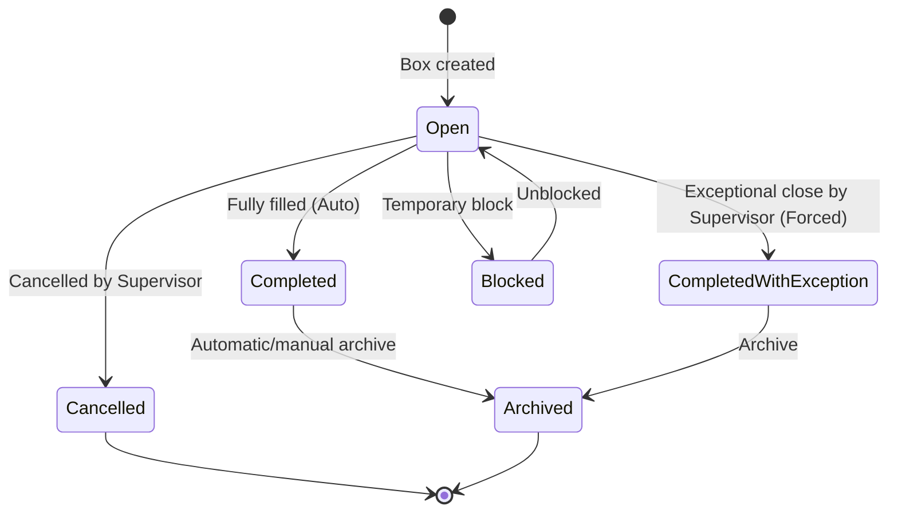

# AGENT.md - Persistent Project Memory

## 1. Project Identity and Business Goal
The **Motherson Box Management** project is an internal web application built for the P3 packaging area at the Motherson plant.
Its main goal is to let operators prepare, track, and audit packaging boxes that contain cable packages identified by barcodes.
**Core value:** Ensure complete traceability of packaging boxes and guarantee that no cable package is ever scanned or assigned to more than one box in the whole system.

## 2. MVP Scope
The MVP runs in a **standalone** way:
* **No external sync:** No connection to ERP or MES.
* **No external package master data:** A cable package is discovered and recorded by the application when it is scanned successfully for the first time.
* **Global uniqueness rule:** A cable package can be linked to one and only one box.
* **English interface.**
* **Built-in scanner simulator:** A virtual panel in the UI simulates USB barcode scanner input (keyboard wedge) to make testing easier without physical hardware.
* **Accepted UX additions beyond the strict specification:** AJAX scan without full page reload, scan sound feedback, and application-level archiving of completed boxes.

## 3. Technologies and Versions
* **Main framework:** ASP.NET Core MVC `[To confirm in the repository, assumed target: 8.0]`
* **Data access:** Entity Framework Core `[To confirm in the repository, assumed target: 8.0]`
* **Database:** SQL Server `[To confirm in the repository, assumed target: 2022]`
* **CSS framework:** Bootstrap `[To confirm in the repository, assumed target: 5.3]`
* **Authentication/Authorization:** Native ASP.NET Core Cookie Authentication with role claims linked to the matricule.

## 4. MVC Architecture and Folder Responsibilities
The architecture follows the standard ASP.NET Core MVC model. Responsibilities are split as follows:
* `MothersonBoxManagement/`
  * `/Controllers`: Thin MVC controllers. They handle routing, validate input ViewModels, and delegate business logic to services.
    * `BoxController`: Read-only operations (Index, Create, Details, Prepare, Scan, ScanAjax).
    * `BoxOperationsController`: Supervisor/Admin mutations (Cancel, ForceClose, Transfer, Block, Unblock) — requires `Supervisor` or `Administrator` role.
  * `/Models`: Contains only ViewModels for display and form submission (for example `LoginViewModel`, `BoxViewModel`, `ScanViewModel`). Database entities must never be exposed directly to MVC views.
  * `/Data`: Contains `ApplicationDbContext`, EF Core configurations (`IEntityTypeConfiguration`), and `/Migrations`.
    * `/Interceptors`: `AuditSaveChangesInterceptor` — the single source of truth for automatic audit logging on `SaveChanges`.
    * `/Dtos`: `BoxMapper` — shared `Expression<Func<Box, BoxDetailsDto>>` used by `BoxService` and `PackageScanService`.
  * `/Entities`: Pure business entities mapped to the database (for example `User`, `Box`, `BoxPackage`, `BoxAuditLog`).
  * `/Security`: `AppRoles` — centralized role constants for authorization (`Supervisor`, `Administrator`, `Operator`).
  * `/Services`: Standalone business services containing all business logic, validation, SQL transactions, state handling, and EF Core calls (for example `IBoxService`, `IScanService`, `IUserService`, `IWorkstationResolver`).
  * `/Views`: Razor pages structured with Bootstrap.
  * `/wwwroot`: Static files (JS scripts for the USB scanner, CSS, images).

## 5. Code and Structure Conventions
* **Naming:**
  * `PascalCase` for types (classes, interfaces, structs, enums), methods, and public properties.
  * `camelCase` for local variables and method arguments.
  * `_camelCase` for private readonly fields.
* **Nullables:** *Nullable Reference Types* (`<Nullable>enable</Nullable>`) must be enabled in `.csproj` files. Every nullable warning must be fixed cleanly.
* **Async:** Always use `async`/`await` for all I/O operations (DB access through EF Core, file reads). Async methods must accept and pass through a `CancellationToken`. `.Result` and `.Wait()` are strictly forbidden to avoid deadlocks.
* **Dependency Injection:** Use the native ASP.NET Core dependency injection container. The *Service Locator* anti-pattern is forbidden.

## 6. Critical Business Rules
* **Barcode format distinction:** Box and package barcodes must be distinguishable by format.
  * *Format:* `BOX-YYYYMMDD-XXXXXX` (where `XXXXXX` is a 6-character uppercase hexadecimal suffix) for the box number and box barcode, which are identical. Cable packages usually start with `PKG-` or another distinct format that does not use the `BOX-` prefix.
  * Any scan of a box code on the package association screen must be rejected with an explicit error.
  * Any package scan on the home or box search screen must be rejected with an explicit error.
* **Whole-centimeter dimensions:** Box dimensions (`Height`, `Width`, `Depth`) are stored as strictly positive whole numbers (`int`) representing centimeters. Decimal, zero, or negative values must be rejected during input and validation.
* **Optimistic concurrency:** Boxes must use optimistic concurrency (`RowVersion` / `byte[]` on SQL Server) to prevent two operators from overwriting each other's changes.
* **Audit immutability:** No record in `BoxAuditLogs` can be modified, updated, or deleted. Write access is append-only through the secured context.

## 7. Roles and Permissions
Users access the application with their unique matricule and password.
Configured roles:
1. **Operator (`Operator`):** Create boxes, scan packages, resume an open box, view personal history. No exception actions are allowed (remove, transfer, cancel, force close).
2. **Supervisor (`Supervisor`):** Has all Operator rights plus exception rights: cancel a box, force close with exception (`CompletedWithException`), change expected quantity, remove/transfer a package, block/unblock a box or package. A reason is required for every exception.
3. **Administrator / IT (`Administrator`):** Has all Supervisor rights plus user account management, access to the full audit log, and barcode format configuration.

## 8. Functional Data Model
All key entities are stored in single tables.

| Entity Name | SQL Table | Key Properties | Relationships & Constraints |
| :--- | :--- | :--- | :--- |
| `User` | `Users` | `Id` (PK), `Matricule` (Unique), `PasswordHash`, `Role` (Enum/String), `IsActive` | - |
| `Box` | `Boxes` | `Id` (PK), `BoxNumber` (Unique), `BarcodeValue` (Unique), `Type` (Enum: Carton, Bois, Plastique), `Height` (int), `Width` (int), `Depth` (int), `ExpectedQuantity`, `CurrentQuantity`, `Status` (Enum), `CreatedByUserId` (FK), `LastModifiedByUserId` (FK), `ClosedByUserId` (FK), `CreatedAt`, `UpdatedAt`, `ClosedAt`, `RowVersion` (ConcurrencyToken) | Relations to `Users` (creator, modifier, closer); one-to-many relation with `BoxPackages`. |
| `BoxPackage` | `BoxPackages` | `Id` (PK), `BoxId` (FK), `PackageBarcode` (Global SQL Unique), `ScannedByUserId` (FK), `ScannedAt` | FK to `Boxes`. **Strict SQL uniqueness constraint on `PackageBarcode`** to prevent the same package from being scanned into two boxes. |
| `BoxAuditLog` | `BoxAuditLogs` | `Id` (PK), `BoxId` (FK, Nullable), `ActionType` (String), `UserId` (FK), `Timestamp`, `WorkstationName`, `DetailsJson` (contains reason, before/after values, gaps, etc.) | Append-only table with no application edit/delete rights. |

## 9. EF Core Migration Status
This section summarizes the history of applied EF Core migrations.

| Migration Name | Main Goal | Status (Applied/Pending) | Data Impact | Rollback / Notes |
| :--- | :--- | :--- | :--- | :--- |
| `20260702125840_InitialSchema` | Create tables `Users`, `Boxes`, `BoxPackages`, `BoxAuditLogs` | Applied | Initial schema | - |
| `20260702143042_UseIntegerBoxDimensions` | Convert `Height`, `Width`, and `Depth` in `Boxes` from double (float) to whole number (int) | Applied | Column conversion | - |

*Regulatory note:* No direct database schema change is allowed without an explicit EF Core migration.

## 10. Essential SQL Constraints
* **Global package uniqueness:** `ALTER TABLE BoxPackages ADD CONSTRAINT UQ_BoxPackages_PackageBarcode UNIQUE (PackageBarcode);`
  * This constraint must be explicitly declared in EF Core with `.HasIndex(p => p.PackageBarcode).IsUnique();`.
* **Search index:** A non-clustered index must exist on `Boxes.BarcodeValue` to speed up redirects from the home page.
* **RowVersion type:** The `RowVersion` column in `Boxes` must be a SQL Server `rowversion` (or `timestamp`) and must be configured as a concurrency token in EF Core with `.IsRowVersion()`.

## 11. Box Statuses and Allowed Transitions
A box follows this state machine:



*Strict rules:*
* A box with status `Completed`, `CompletedWithException`, `Cancelled`, `Archived`, or `Blocked` must always reject new package scans.
* Packages linked to a `Cancelled` box are not released automatically; they stay attached to the cancelled box to preserve history. An explicit supervisor disassociation action is required to release them.

## 12. Box and Package Scan Flow
### A. Box Scan (Direct access from the home page)
1. The user focuses the "Scan a box" field on the home page.
2. The USB scanner reads the box barcode (`BOX-...`) and submits the input.
3. The system captures the input, validates the box code format, and looks up the box in the database.
4. If the box exists and is `Open`: redirect to the preparation and package association page.
5. If the box exists and is closed (`Completed`, `CompletedWithException`, `Cancelled`, `Archived`) or `Blocked`: redirect to the read-only details view (with a warning for blocked boxes).
6. If the box does not exist: show a clear error message such as "Unknown box".

### B. Package Scan (From the preparation screen)
1. The operator scans a package barcode (`PKG-...`).
2. The system captures the code and performs these checks inside an isolated SQL transaction:
   * Format validation: the scanned code must be a package, not a box.
   * Box state: the box must be `Open`.
   * Uniqueness: check that the barcode does not already exist in `BoxPackages`, whether in this box or another one.
   * Quantity: check that the expected quantity has not already been reached.
3. If all validations pass:
   * Create the row in `BoxPackages` with the logged-in operator user ID and timestamp.
   * Increment `CurrentQuantity` on the box.
   * Add a `PackageScanned` audit record.
   * If `CurrentQuantity` becomes equal to `ExpectedQuantity`: automatically change the box status to `Completed` and write a `BoxCompletedAuto` audit log.
4. If a validation fails: reject the scan immediately, roll back the transaction, write a `PackageRejected` audit entry (to trace errors or fraud attempts), and show a clear red error message on screen.

## 13. Useful Commands
*(Run these commands from the C# solution root)*
* **Restore dependencies:**
  ```powershell
  dotnet restore
  ```
* **Build the project:**
  ```powershell
  dotnet build
  ```
* **Run unit and integration tests:**
  ```powershell
  dotnet test
  ```
* **Add an EF Core migration:**
  ```powershell
  dotnet ef migrations add <MigrationName> --project <DataOrWebProjectPath> --startup-project <WebProjectPath>
  ```
* **Update the database:**
  ```powershell
  dotnet ef database update --project <DataOrWebProjectPath> --startup-project <WebProjectPath>
  ```

## 14. Secure Local Configuration
Development configuration uses `appsettings.Development.json` or the .NET Secrets Manager tool (`dotnet user-secrets`).
**Required environment variables (secure placeholders):**
* `ConnectionStrings__DefaultConnection`: Local SQL Server connection string (for example `Server=(localdb)\\mssqllocaldb;Database=MothersonBoxManagement;Trusted_Connection=True;MultipleActiveResultSets=true`).
* `Authentication__CookieName`: Session cookie name (for example `Motherson.BoxManagement.Auth`).
* `Authentication__ExpireTimeSpanMinutes`: Session lifetime in minutes (for example `60`).

> [!CAUTION]
> Never commit production secrets (real passwords, real production connection strings) to source code or Git repositories.

## 15. Main MVC Routes and Endpoints
* `/Account/Login`: Login screen (POST authenticates).
* `/Account/Logout`: Sign out the session (requires `[Authorize]`).
* `/` or `/Home/Index`: Main dashboard. Contains the "Scan a box" field and the list of active boxes.
* `/Box/Index`: Multi-criteria box search and tracking screen (all roles).
* `/Box/Create`: Box creation form (Operator/Supervisor/Admin).
* `/Box/Prepare/{id}`: Package scan screen for an open box (Operator/Supervisor/Admin). Contains the virtual scan simulator.
* `/Box/Details/{id}`: Read-only box view with scanned packages and related audit history.
* `/Box/Scan`: Standard package scan action (POST, Operator/Supervisor/Admin).
* `/Box/ScanAjax`: AJAX package scan action (POST, Operator/Supervisor/Admin, returns JSON).
* `/Box/Cancel/{id}`: Cancel action (POST, Supervisor/Admin only, reason required).
* `/Box/ForceClose/{id}`: Close with exception action (POST, Supervisor/Admin only, reason required).
* `/Box/Transfer`: Package transfer action (POST, Supervisor/Admin only, reason required).
* `/Box/Block/{id}` / `/Box/Unblock/{id}`: Block/unblock actions (POST, Supervisor/Admin only, reason required).

## 16. Important NuGet Packages and Why They Matter
* `Microsoft.EntityFrameworkCore.SqlServer`: Official EF Core SQL Server provider (required).
* `Microsoft.EntityFrameworkCore.Design` and `Microsoft.EntityFrameworkCore.Tools`: Needed for migration generation and command-line database management.

## 17. Architecture Decision Log (Light ADR)
Every significant architecture decision must be recorded here.

| Date | Decision | Context | Reasons | Impact | Status |
| :--- | :--- | :--- | :--- | :--- | :--- |
| 2026-07-02 | Single tables for Boxes and Packages | The specification requires avoiding dynamic tables per box. | Easier search, indexing, global reports, and audits. | Simple and efficient standard relational schema. | **Validated** |
| 2026-07-02 | Cookie Authentication without ASP.NET Identity | Internal matricule-based identification, no public sign-up and no OAuth flow. | Lighter and aligned with simple validation against the `Users` table. | Fewer framework tables to maintain, full control of the `Users` schema. | **Validated** |
| 2026-07-02 | EF Core interceptor for audit | Need for append-only, immutable, automatic history for all operations. | Centralizes auditing in `SaveChanges` / `SaveChangesAsync` so no change can escape logging. | Clean implementation decoupled from MVC controllers. | **Validated** |
| 2026-07-05 | Split BoxController into BoxController + BoxOperationsController | BoxController had 513 lines with 20 actions mixing read and write operations. | Cleaner separation of concerns; supervisor-only mutations are now isolated with `[Authorize]` attributes. | `BoxController` (read/create/scan) and `BoxOperationsController` (Cancel, ForceClose, Transfer, Block, Unblock). | **Validated** |
| 2026-07-05 | Centralized role constants via AppRoles | Role strings were hardcoded in multiple controllers and views. | Single source of truth for role names; prevents typos and makes role renaming safer. | `Security/AppRoles.cs` with `Supervisor`, `Administrator`, `Operator` constants. | **Validated** |
| 2026-07-05 | Shared WorkstationResolver service | Duplicated workstation resolution logic in `BoxController` and `AuditSaveChangesInterceptor`. | DRY principle; single implementation for resolving workstation from HTTP context or environment. | `IWorkstationResolver` / `WorkstationResolver` injected where needed. | **Validated** |
| 2026-07-05 | Shared BoxMapper expression for DTO projection | `BoxService` and `PackageScanService` had nearly identical `BoxDetailsDto` mapping code. | Single `Expression<Func<Box, BoxDetailsDto>>` shared via `BoxMapper` ensures consistency and allows EF Core SQL translation. | `Data/Dtos/BoxMapper.cs` — both services use `BoxMapper.BoxDetailsProjection`. | **Validated** |
| 2026-07-05 | Audit logging consolidated to interceptor only | Explicit `_auditService.LogBoxUpdatedAsync` / `LogPackageScannedAsync` calls scattered across services. | Interceptor handles all audit automatically on `SaveChanges`; explicit calls were redundant and inconsistent. | `IAuditService` simplified to rejection-only (`LogScanRejectionAsync`). All other audit via interceptor. | **Validated** |
| 2026-07-05 | DateTime.UtcNow across codebase | `DateTime.Now` was used inconsistently for timestamps. | Consistent UTC timestamps prevent timezone-related bugs in audit logs and box metadata. | All `DateTime.Now` replaced with `DateTime.UtcNow` in services and interceptor. | **Validated** |
| 2026-07-05 | In-memory brute force lockout | No protection against credential stuffing or brute force attacks on login. | `ConcurrentDictionary`-based lockout is sufficient for an internal app; avoids DB migration overhead. Resets on app restart — acceptable for internal tool. | `LoginLockoutService` (Scoped) — 5 attempts / 15-min lockout. | **Validated** |
| 2026-07-05 | Built-in ASP.NET Core rate limiting | No rate limiting on any endpoint (scan, login, API). | No new NuGet dependency required (included in ASP.NET Core 8.0 shared framework); built-in token-bucket and fixed-window limiters are sufficient. | Three policies: `login` (TokenBucket, 5/min per matricule), `scan` (FixedWindow, 60/min per user), `global` (FixedWindow, 200/min). | **Validated** |
| 2026-07-05 | Logout as POST with antiforgery | Logout as GET is vulnerable to CSRF (image tags, links can trigger logout). | Standard CSRF mitigation; `[ValidateAntiForgeryToken]` ensures logout requires a legitimate form submission. | `AccountController.Logout` converted to `[HttpPost]`; `_Layout.cshtml` logout button changed to `<form>` with `@Html.AntiForgeryToken()`. | **Validated** |
| 2026-07-05 | Conditional HTTPS redirection | HTTPS is mandatory in production but breaks `WebApplicationFactory` tests that run HTTP-only. | Conditional `UseHttpsRedirection()` (only when HTTPS port is configured) and `SameAsRequest` cookie policy in Development preserves test compatibility while enforcing HTTPS in production. | `UseHttpsRedirection()` wrapped in port-check; `CookieSecurePolicy` set per environment. | **Validated** |
| 2026-07-05 | Dockerized V1 local release path | V1 needed a reproducible startup path for demo, validation, and GitHub release handoff. | `Dockerfile`, `docker-compose.yml`, `.env.example`, and `.dockerignore` provide a simple app + SQL Server bootstrap without changing app behavior. | Local release environment now works through Docker or direct .NET startup; docs aligned. | **Validated** |

## 18. Assumptions and Open Points
* **Exact barcode format:** The exact prefixes (`BOX-` and `PKG-`) must be confirmed with the production teams in the P3 area.
* **Scan hardware:** USB scanner behavior (keyboard wedge sending `Enter` automatically at the end) must be tested on the target factory terminals.
* **Data volume:** Define archive frequency for boxes to avoid slowing down `BoxPackages` over time.
* **Documentation alignment with CDC v1.5:** The SQL table in the PDF still mentions `decimal(10,2)` dimensions, but the repository and migration `20260702143042_UseIntegerBoxDimensions` define strictly positive whole-centimeter dimensions.

## 19. Risks and Technical Debt
* **Concurrent double-scan risk:** Two operators scan the same package barcode at the same time into two different boxes.
  * *Mitigation:* Strict SQL uniqueness constraint handled by SQL Server to raise a concurrency exception at transaction level.
* **Secrets in the repository:** Risk of leaking connection strings through config commits.
  * *Mitigation:* Use a local `appsettings.Development.json` ignored by Git (or containing only placeholders) and environment variables.

## 20. GSD Core Integration and Sync Rules
* The agent must always sync its tasks with the GSD Core workflow.
* Every started task must be marked `In progress` in `TODO.md` with the matching GSD phase/plan reference.
* Internal GSD Core artifacts (`.planning/`) must never be edited manually outside GSD commands or processes.
* Task progress must be updated regularly in `TODO.md` so it accurately reflects the real repository status.

## 21. Required Checklist Before Any Change
1. Read `.planning/PROJECT.md` and `.planning/ROADMAP.md` to identify the active phase.
2. Check `AGENT.md` to understand the business rules for the entities being changed.
3. Review `TODO.md` and make sure the task is marked `In progress` (or create it for a quick/corrective task).
4. Make sure the workspace is clean (`git status` with no unexpected changes).

## 22. Required Checklist After Any Change
1. Run the local build (`dotnet build`) and fix all warnings/errors.
2. Run unit tests (`dotnet test`) and ensure no tests regress.
3. If the database schema changed: generate the matching EF Core migration and apply it locally for testing.
4. Update `AGENT.md` if an entity, relationship, status, or architecture decision changed.
5. Update `TODO.md`, moving the task to `Completed` or `In review`.
6. Write a Conventional Commits message.

## 23. Security Audit Status
A comprehensive security audit was performed on 2026-07-05. The following vulnerabilities were identified and fixed:

### Fixed Vulnerabilities
| ID | Severity | Description | Fix | Status |
| :--- | :--- | :--- | :--- | :--- |
| VULN-02 | High | No brute force protection on login | `LoginLockoutService` — in-memory 5-attempt lockout with 15-minute window (`ConcurrentDictionary`) | **Fixed** |
| VULN-03 | Medium | Self-deactivation allowed (admin could lock themselves out) | `UsersController.Deactivate` now checks `GetCurrentUserId()` and prevents self-deactivation | **Fixed** |
| VULN-04 | Medium | No rate limiting on endpoints | ASP.NET Core built-in rate limiting: `login` (TokenBucket, 5/min), `scan` (FixedWindow, 60/min), `global` (FixedWindow, 200/min) | **Fixed** |
| VULN-05 | Low | Missing security response headers | Middleware adds `X-Content-Type-Options: nosniff`, `X-Frame-Options: DENY`, `Referrer-Policy`, `X-XSS-Protection: 0`, `Permissions-Policy` | **Fixed** |
| VULN-06 | Medium | Logout as GET (CSRF logout via image/link) | Converted to `[HttpPost]` with `[ValidateAntiForgeryToken]`; `_Layout.cshtml` logout changed from `<a>` to `<form method="post">` with anti-forgery token | **Fixed** |
| VULN-07 | Medium | Hardcoded credentials in `appsettings.json` | Cleared connection string to empty placeholder; real credentials must come from environment variables or User Secrets | **Fixed** |
| VULN-08 | Low | CDN resources loaded without `crossorigin` attribute | Added `crossorigin="anonymous"` to Bootstrap CSS, Bootstrap JS, and Google Fonts CDN links | **Fixed** |
| VULN-10 | Medium | No HTTPS redirection | `UseHttpsRedirection()` added (conditional — skipped in Development for test compatibility); `UseHsts()` added for non-Development | **Fixed** |
| VULN-11 | Low | Cookie `SecurePolicy` not enforced | `CookieSecurePolicy.Always` in Production; `SameAsRequest` in Development (for test compatibility) | **Fixed** |

### Open / Not Yet Fixed
| ID | Severity | Description | Recommendation |
| :--- | :--- | :--- | :--- |
| VULN-01 | Critical | Default password `Motherson2026!` displayed on login page | Remove default credentials from the login view; require first-login password change or use temporary passwords |
| VULN-09 | Low | No password expiry / rotation policy | Implement configurable password expiry (e.g., 90 days) and force change on first login |

### Security Services Added
* `ILoginLockoutService` / `LoginLockoutService` — brute force lockout service (in-memory, `ConcurrentDictionary`-based). Registered as `Scoped`.
* Rate limiting middleware — configured in `Program.cs` with three policies: `login`, `scan`, `global`.
* Security headers middleware — inline `Use()` pipeline in `Program.cs`.

### Security Configuration (`appsettings.json`)
* `Security:LoginLockout:MaxAttempts` — maximum failed login attempts (default: 5).
* `Security:LoginLockout:LockoutMinutes` — lockout duration in minutes (default: 15).
* `AllowedHosts` restricted from `*` to `localhost`.
* `ConnectionStrings:DefaultConnection` cleared to empty placeholder (real values via environment variables).

### Security Middleware Pipeline Order (Program.cs)
1. Exception handler + HSTS (non-Development)
2. HTTPS redirection (conditional)
3. Static files
4. Status code pages
5. Rate limiter
6. Security headers
7. Routing
8. Authentication
9. Authorization

### Test Compatibility
* `UseHttpsRedirection()` is conditionally applied only when an HTTPS port is configured (avoids breaking `WebApplicationFactory` tests that run over HTTP-only).
* `CookieSecurePolicy` is `SameAsRequest` in Development to allow test clients to receive and send cookies over HTTP.

## 24. Latest Validation State
* **2026-07-05:** Final V1 release pass completed. Added release metadata (`v1`), a subtle in-app version marker, Docker startup support (`Dockerfile`, `docker-compose.yml`, `.env.example`), and refreshed onboarding/configuration/testing documentation. Validation is green with `dotnet build` passing and **129 passing tests out of 129**.

---
> **Golden rule:** Any change to an entity, relationship, migration, SQL constraint, index, persistence rule, business status, authorization, MVC route, NuGet package, or architecture decision must trigger an update to `AGENT.md`.
