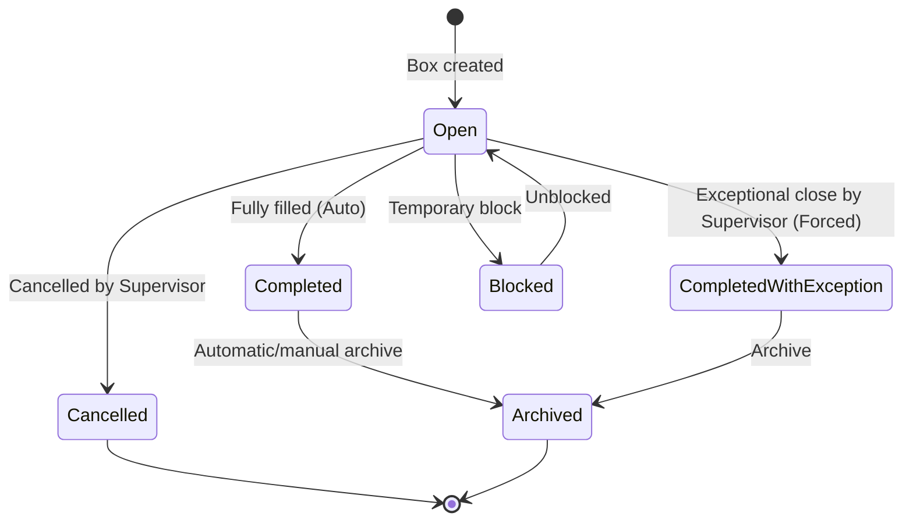

# AGENT.md - Persistent Project Memory

## 1. Project Identity and Business Goal
The **Motherson Box Management** project is an internal web application built for the P3 packaging area at the Motherson plant.
Its main goal is to let operators prepare, track, and audit packaging boxes that contain cable packages identified by barcodes.
**Core value:** Ensure complete traceability of packaging boxes and guarantee that no cable package is ever scanned or assigned to more than one box in the whole system.

## 2. MVP Scope
The MVP runs in a **standalone** way:
* **No external sync:** No connection to ERP or MES.
* **No external package master data:** A cable package is discovered and recorded by the application when it is scanned successfully for the first time.
* **Global uniqueness rule:** A cable package can be linked to one and only one box.
* **English interface.**
* **Built-in scanner simulator:** A virtual panel in the UI simulates USB barcode scanner input (keyboard wedge) to make testing easier without physical hardware.
* **Browser station identity:** Each physical terminal stores its station name in browser local storage and sends it with scan and supervisor operations so audit logs identify the operator workstation, not the central web server/container.
* **Accepted UX additions beyond the strict specification:** AJAX scan without full page reload, scan sound feedback, and application-level archiving of completed boxes.

## 3. Technologies and Versions
* **Main framework:** ASP.NET Core MVC `[To confirm in the repository, assumed target: 8.0]`
* **Data access:** Entity Framework Core `[To confirm in the repository, assumed target: 8.0]`
* **Database:** SQL Server `[To confirm in the repository, assumed target: 2022]`
* **CSS framework:** Bootstrap `[To confirm in the repository, assumed target: 5.3]`
* **Authentication/Authorization:** Native ASP.NET Core Cookie Authentication with role and security-stamp claims linked to the matricule.

## 4. MVC Architecture and Folder Responsibilities
The architecture follows the standard ASP.NET Core MVC model. Responsibilities are split as follows:
* `MothersonBoxManagement/`
  * `/Configuration`: Extension methods for DI, authentication, rate limiting, middleware, and database initialization (extracted from `Program.cs`).
    * `AuthenticationConfiguration.cs` — Cookie auth + security stamp validation.
    * `RateLimitingConfiguration.cs` — Login/scan/global rate limit policies.
    * `SecurityHeadersConfiguration.cs` — CSP/security headers middleware.
    * `DatabaseInitializationExtensions.cs` — Auto-migration + demo seeding.
  * `/Controllers`: Thin MVC controllers. They handle routing, validate input ViewModels, and delegate business logic to services.
    * `AccountController`: Login/logout.
    * `AuditController`: Read-only audit log with filters and pagination (uses `IAuditService`).
    * `BoxController`: Box creation from templates, settings, read/search operations, print view, scan association endpoints, and **auto-scan with prefix matching** (`POST /Box/AutoScanPackage`). Creation/open/print/settings require `Supervisor` or `Administrator`.
    * `BoxOperationsController`: Supervisor/Admin mutations (Cancel, ForceClose, Transfer, Block, Unblock) — requires `Supervisor` or `Administrator` role.
    * `BoxTemplateController`: Template CRUD (Supervisor/Admin only).
    * `DashboardController`: Main dashboard and template selection page.
    * `UsersController`: User management (Admin only).
  * `/Data`: Contains `ApplicationDbContext`, `DbInitializer`, and `/Interceptors` (`AuditSaveChangesInterceptor`).
  * `/Dtos`: Data Transfer Objects shared across layers (`BoxDetailsDto`, `BoxListItemDto`, `BoxMapper`, `BoxSearchFilterDto`, `BoxTemplateDto`, `CreateBoxDto`, `CreateBoxTemplateDto`, `ScanResult`, `UserListItemDto`, `AuditFilterDto`).
  * `/Entities`: Pure business entities mapped to the database (`User`, `Box`, `BoxPackage`, `BoxAuditLog`, `BoxTemplate`, `BoxPrintJob`, etc.).
  * `/Migrations`: EF Core migration files.
  * `/Models`: All ViewModels for display and form submission (`LoginViewModel`, `HomeViewModel`, `BoxTemplateViewModel`, `PrintLabelViewModel`, `TemplateSelectionViewModel`, `UserViewModels`, `AuditIndexViewModel`, `ErrorViewModel`). Database entities must never be exposed directly to MVC views.
  * `/Security`: `AppRoles` — centralized role constants for authorization.
  * `/Services`: Standalone business services containing all business logic, validation, SQL transactions, state handling, and EF Core calls.
  * `/Views`: Razor pages structured with Bootstrap.
  * `/wwwroot`: Static files (JS scripts for the USB scanner, CSS, images).
* `MothersonBoxManagement.Tests/`: xUnit integration tests using `WebApplicationFactory` and EF Core InMemory.

## 5. Code and Structure Conventions
* **Naming:**
  * `PascalCase` for types (classes, interfaces, structs, enums), methods, and public properties.
  * `camelCase` for local variables and method arguments.
  * `_camelCase` for private readonly fields.
* **Nullables:** *Nullable Reference Types* (`<Nullable>enable</Nullable>`) must be enabled in `.csproj` files. Every nullable warning must be fixed cleanly.
* **Async:** Always use `async`/`await` for all I/O operations (DB access through EF Core, file reads). Async methods must accept and pass through a `CancellationToken`. `.Result` and `.Wait()` are strictly forbidden to avoid deadlocks.
* **Dependency Injection:** Use the native ASP.NET Core dependency injection container. The *Service Locator* anti-pattern is forbidden.

## 6. Critical Business Rules
* **Barcode format distinction:** Box and package barcodes must be distinguishable by format.
  * *Format:* `BOX-YYYYMMDD-XXXXXX` (where `XXXXXX` is a 6-character uppercase hexadecimal suffix) for the box number and box barcode, which are identical. Cable packages usually start with `PKG-` or another distinct format that does not use the `BOX-` prefix.
  * Package association supports two modes:
    * **Manual double-scan:** Scan box barcode → scan package barcode → association created. After association, the scanner enters **sticky mode** where subsequent package scans go to the same box without re-scanning the box.
    * **Auto-scan with prefix:** If a package barcode starts with a `PackagePrefixPattern` defined in an active template, the system automatically creates a box from that template, adds the package, prints the QR, and enters sticky mode.
  * In sticky mode, scanning a different BOX barcode redirects to that box and exits sticky mode. When a box is completed (full), sticky mode exits automatically.
  * Any package scan on the home or box search screen must be rejected with an explicit error.
* **Auto-scan prefix matching:** Each `BoxTemplate` can have an optional `PackagePrefixPattern` (digits only, max 50 chars). When a package is scanned, all active templates with a non-empty prefix are checked. Match = package barcode starts with the template prefix (case-insensitive). If multiple templates match, the **longest prefix** wins (most specific). If no template matches, the manual double-scan flow is used.
* **Package uniqueness:** Once a package is scanned and associated with a box, it can NEVER be re-scanned or associated with another box. This is enforced by a strict SQL uniqueness constraint on `BoxPackages.PackageBarcode`. The only exception is a supervisor-initiated logical removal/disassociation.
* **Box creation authority:** Operators must never create boxes manually. Boxes are created only from approved templates and the system generates the box identity and barcode/QR value automatically. Operators may create/open a box from an approved template, while template management remains restricted to Supervisors and Administrators.
* **Whole-centimeter dimensions:** Box dimensions (`Height`, `Width`, `Depth`) are stored as strictly positive whole numbers (`int`) representing centimeters. Decimal, zero, or negative values must be rejected during input and validation.
* **Optimistic concurrency:** Boxes must use optimistic concurrency (`RowVersion` / `byte[]` on SQL Server) to prevent two operators from overwriting each other's changes.
* **Audit immutability:** No record in `BoxAuditLogs` can be modified, updated, or deleted. Write access is append-only through the secured context.

## 7. Roles and Permissions
Users access the application with their unique matricule and password.
Configured roles:
1. **Operator (`Operator`):** Create/open a box from an approved template, scan a box and then one package to create each box/package link, resume an open box through the same double-scan rule, search/view boxes and packages, and view personal history. Operators must rescan the box before every package; they cannot reuse a previous box scan for multiple packages. Operators cannot manage templates or use exception actions (remove, transfer, cancel, force close).
2. **Supervisor (`Supervisor`):** Has all Operator rights plus box creation and exception rights: create boxes, cancel a box, force close with exception (`CompletedWithException`), change expected quantity, remove/transfer a package, block/unblock a box or package. A reason is required for every exception.
3. **Administrator / IT (`Administrator`):** Has all Supervisor rights plus user account management, access to the full audit log, and barcode format configuration.

## 8. Functional Data Model
All key entities are stored in single tables.

| Entity Name | SQL Table | Key Properties | Relationships & Constraints |
| :--- | :--- | :--- | :--- |
| `User` | `Users` | `Id` (PK), `Matricule` (Unique), `PasswordHash`, `Role` (Enum/String), `IsActive`, `SecurityStamp` | Cookie sessions are rejected when the stored security stamp changes or the user is inactive. |
| `Box` | `Boxes` | `Id` (PK), `BoxNumber` (Unique), `BarcodeValue` (Unique), `Type` (Enum: Carton, Bois, Plastique), `Height` (int), `Width` (int), `Depth` (int), `ExpectedQuantity`, `CurrentQuantity`, `Status` (Enum), `CreatedByUserId` (FK), `LastModifiedByUserId` (FK), `ClosedByUserId` (FK), `CreatedAt`, `UpdatedAt`, `ClosedAt`, `RowVersion` (ConcurrencyToken) | Relations to `Users` (creator, modifier, closer); one-to-many relation with `BoxPackages`. |
| `BoxPackage` | `BoxPackages` | `Id` (PK), `BoxId` (FK), `PackageBarcode` (Global SQL Unique), `ScannedByUserId` (FK), `ScannedAt`, `IsRemoved`, `RemovedAt`, `RemovedByUserId`, `RemovalReason` | FK to `Boxes`. **Strict SQL uniqueness constraint on `PackageBarcode`** to prevent the same package from being scanned into two boxes. Removal/disassociation is logical only so history remains queryable. |
| `BoxAuditLog` | `BoxAuditLogs` | `Id` (PK), `BoxId` (FK, Nullable), `ActionType` (String), `UserId` (FK), `Timestamp`, `WorkstationName`, `DetailsJson` (contains reason, before/after values, gaps, etc.) | Append-only table with no application edit/delete rights. |
| `BoxTemplate` | `BoxTemplates` | `Id` (PK), `Name`, `Description`, `Type` (Enum), `Height`, `Width`, `Depth`, `ExpectedQuantity`, `PackagePrefixPattern` (nullable, digits only), `IsActive`, `CreatedByUserId` (FK), `CreatedAt`, `UpdatedAt` | Reusable templates for box creation. `PackagePrefixPattern` enables auto-scan: when a scanned package barcode starts with this prefix, a box is automatically created from the template. |

## 9. EF Core Migration Status
This section summarizes the history of applied EF Core migrations.

| Migration Name | Main Goal | Status (Applied/Pending) | Data Impact | Rollback / Notes |
| :--- | :--- | :--- | :--- | :--- |
| `20260702125840_InitialSchema` | Create tables `Users`, `Boxes`, `BoxPackages`, `BoxAuditLogs` | Applied | Initial schema | - |
| `20260702143042_UseIntegerBoxDimensions` | Convert `Height`, `Width`, `Depth` in `Boxes` from double to int | Applied | Column conversion | - |
| `20260704003307_AddBoxPackageBlocking` | Add `IsBlocked` and `BlockReason` to `BoxPackages` | Applied | New columns | - |
| `20260704003659_AddBoxExceptionReason` | Add `ExceptionReason` to `Boxes` | Applied | New column | - |
| `20260704130001_RenameColumnsAndAddMissingFields` | Rename `UpdatedAt` to `ModifiedAt`, `ClosedByUserId` to `CompletedByUserId`; add `CompletionMode` | Applied | Column renames | - |
| `20260704155338_DimensionsDecimalAndAuditDescription` | Add `CreatedAt`/`UpdatedAt` to Users; add `Description` to audit log | Applied | New columns | - |
| `20260706133916_AddCdcFieldsAndPrintJobs` | Add CDC scan fields to `BoxPackages` and create `BoxPrintJobs` table | Applied | New table + columns | - |
| `20260706161659_CleanupDeadFields` | Remove unused `QrCodeValue` index and dead scan fields | Applied | Column drops | - |
| `20260706235753_RemoveRelatedBoxIdFromAuditLog` | Drop `RelatedBoxId` FK from `BoxAuditLogs` | Applied | Column drop | - |
| `20260707011309_AddBoxTemplate` | Create `BoxTemplates` table for reusable box templates | Applied | New table | - |
| `20260708004620_AuditRemediationSecurityAndTraceability` | Add `SecurityStamp` to Users; add soft-removal fields to `BoxPackages` | Applied | Backfills stamps; adds `IsRemoved`, `RemovedAt`, `RemovedByUserId`, `RemovalReason` | - |
| `20260709082658_AddPackagePrefixPattern` | Add `PackagePrefixPattern` to `BoxTemplates` for auto-scan prefix matching | Applied | New nullable column | - |
| `20260709090941_AddLoginAttemptsTable` | Create `LoginAttempts` table for brute force tracking | Applied | New table | - |
| `20260709110708_AddPrinterConfigurationAndExtendPrintJobs` | Extend `BoxPrintJobs` with failure tracking; create `PrinterConfigurations` table | Applied | New table + columns | - |
| `20260709131640_AddBarcodeConfiguration` | Create `BarcodeConfigurations` table for barcode format settings | Applied | New table | - |
| `20260712150705_AddSystemAuditPrincipal` | Insert SYSTEM user (Id=-1) for automated audit events | Applied | Seed data | - |
| `20260712200405_AllowHistoricalPackageReassociation` | Change `PackageBarcode` unique index to filtered (only non-removed) | Applied | Index change | - |
| `20260712201848_AddCriticalBoxCheckConstraints` | Add CHECK constraints for positive quantities and dimensions | Applied | Data validation | - |
| `20260712205044_BoundStringsAndScanIdempotency` | Add string length limits across all tables; add scan idempotency fields | Applied | Column alterations | - |
| `20260713001629_ProductionRemediationActivePrefix` | Normalize prefix patterns; add unique partial index on active prefixes | Applied | Data normalization | - |
| `20260713082536_AddPasswordResetWorkflow` | Create `PasswordResetRequests` table for password recovery flow | Applied | New table | - |
| `20260713120000_AddLocalPrintAgent` | Add print agent fields (`LeaseTokenHash`, `AgentTokenHash`, `PrintMode`, etc.) | Applied | New columns | - |
| `20260714153000_AddRemoteWorkstationAdministration` | Add `DisplayName` and `LastIpAddress` to `PrinterConfigurations` | Applied | New columns | - |

*Regulatory note:* No direct database schema change is allowed without an explicit EF Core migration.

## 10. Essential SQL Constraints
* **Global package uniqueness:** `ALTER TABLE BoxPackages ADD CONSTRAINT UQ_BoxPackages_PackageBarcode UNIQUE (PackageBarcode);`
  * This constraint must be explicitly declared in EF Core with `.HasIndex(p => p.PackageBarcode).IsUnique();`.
* **Search index:** A non-clustered index must exist on `Boxes.BarcodeValue` to speed up redirects from the home page.
* **RowVersion type:** The `RowVersion` column in `Boxes` must be a SQL Server `rowversion` (or `timestamp`) and must be configured as a concurrency token in EF Core with `.IsRowVersion()`.

## 11. Box Statuses and Allowed Transitions
A box follows this state machine:



*Strict rules:*
* A box with status `Completed`, `CompletedWithException`, `Cancelled`, `Archived`, or `Blocked` must always reject new package scans.
* Packages linked to a `Cancelled` box are not released automatically; they stay attached to the cancelled box to preserve history. An explicit supervisor disassociation action is required to release them.

## 12. Box and Package Scan Flow
The scanner operates as a 3-state machine: `IDLE`, `AWAITING_BOX`, and `HAS_BOX` (sticky mode).

### A. Box Scan (Direct access from the home page)
1. The user focuses the "Scan a box" field on the home page.
2. The USB scanner reads the box barcode (`BOX-...`) and submits the input.
3. The system captures the input, validates the box code format, and looks up the box in the database.
4. If the box exists and is `Open`: redirect to the preparation and package association page.
5. If the box exists and is closed (`Completed`, `CompletedWithException`, `Cancelled`, `Archived`) or `Blocked`: redirect to the read-only details view (with a warning for blocked boxes).
6. If the box does not exist: show a clear error message such as "Unknown box".

### B. Package Scan — Auto-Scan with Prefix (From the global scanner)
1. Operator scans a package barcode (any page with the global scanner active).
2. The scanner calls `POST /Box/AutoScanPackage` with the package barcode.
3. The system checks all active templates for a matching `PackagePrefixPattern`:
   * If a template matches: create a new box from the template, associate the package, print the QR label, and enter **sticky mode** with the new box.
   * If no template matches: return `noMatch: true` and the scanner falls through to the manual double-scan flow (state `AWAITING_BOX`).
4. Sound feedback: success beeps + sticky mode confirmation beeps after overlay dismisses.

### C. Package Scan — Manual Double Scan (From the global scanner)
1. Operator scans a package barcode. No template prefix matches.
2. The scanner enters `AWAITING_BOX` state with a 30-second countdown.
3. Operator scans a box barcode (`BOX-...`) within 30 seconds.
4. The system validates and associates the package with the box.
5. On success: the scanner enters **sticky mode** with this box.
6. On timeout: the pending scan is cleared, back to `IDLE`.

### D. Sticky Mode (`HAS_BOX` state)
Once a box is selected (by auto-scan or manual double-scan), the scanner stays in sticky mode:
1. Every subsequent package scan is associated directly with the current box — no need to re-scan the box.
2. Sound feedback: success beeps for each package, sticky mode confirmation beeps after the first association.
3. The operator can keep scanning packages until the box is full.
4. **Exit conditions:**
   * Box is completed (currentQuantity >= expectedQuantity): plays a **box completion fanfare** (4 ascending notes), exits to `IDLE`.
   * Operator scans a different BOX barcode: redirects to that box's details page, exits to `IDLE`.
5. Errors (duplicate package, blocked package, etc.) show an error overlay but do NOT exit sticky mode — the operator can continue scanning other packages.

### E. Package Association Validation (inside an isolated SQL transaction)
The system performs these checks for every package association:
* Format validation: the scanned code must be a package, not a box.
* Box state: the box must be `Open`.
* Uniqueness: check that the barcode does not already exist in `BoxPackages` (global unique constraint).
* Quantity: check that the expected quantity has not already been reached.
* If all validations pass: create `BoxPackages` row, increment `CurrentQuantity`, audit log. If `CurrentQuantity >= ExpectedQuantity`: auto-complete the box.
* If a validation fails: reject, rollback, audit log with rejection reason, show error.

## 13. Useful Commands
*(Run these commands from the C# solution root)*
* **Restore dependencies:**
  ```powershell
  dotnet restore
  ```
* **Build the project:**
  ```powershell
  dotnet build
  ```
* **Run unit and integration tests:**
  ```powershell
  dotnet test
  ```
* **Add an EF Core migration:**
  ```powershell
  dotnet ef migrations add <MigrationName> --project <DataOrWebProjectPath> --startup-project <WebProjectPath>
  ```
* **Update the database:**
  ```powershell
  dotnet ef database update --project <DataOrWebProjectPath> --startup-project <WebProjectPath>
  ```

## 14. Secure Local Configuration
Development configuration uses `appsettings.Development.json` or the .NET Secrets Manager tool (`dotnet user-secrets`).
**Required environment variables (secure placeholders):**
* `ConnectionStrings__DefaultConnection`: Local SQL Server connection string (for example `Server=(localdb)\\mssqllocaldb;Database=MothersonBoxManagement;Trusted_Connection=True;MultipleActiveResultSets=true`).
* `Authentication__CookieName`: Session cookie name (for example `Motherson.BoxManagement.Auth`).
* `Authentication__ExpireTimeSpanMinutes`: Session lifetime in minutes (for example `60`).
* `MOTHERSON_SQL_PORT`: Docker SQL Server host port for local development (default template uses `11433` to avoid conflicts with existing local SQL Server instances on `1433`).

> [!CAUTION]
> Never commit production secrets (real passwords, real production connection strings) to source code or Git repositories.

## 15. Main MVC Routes and Endpoints
* `/Account/Login`: Login screen (POST authenticates).
* `/Account/Logout`: Sign out the session (requires `[Authorize]`).
* `/` or `/Home/Index`: Main dashboard. Contains the "Scan a box" field and the list of active boxes.
* `/Dashboard/Templates`: Dedicated template selection page for creating a new box from an approved template (Operator/Supervisor/Admin).
* `/Box/Index`: Multi-criteria box search and tracking screen (all roles).
* `/Box/Create`: Box creation form (Supervisor/Admin only).
* `/Box/CreateFromTemplate`: Create and open a box from an approved template (POST, any authenticated role; template management remains Supervisor/Admin only).
* `/Box/Open`: Open a created box for preparation (POST, Supervisor/Admin only).
* `/Box/Print/{barcode}`: Printable QR/barcode label view (Supervisor/Admin only).
* `/Box/PrintClient/{barcode}`: Browser-side printable QR/barcode label view for automatic workstation printing after template-based creation (any authenticated role).
* `/Box/Settings`: Browser-local station and printer settings (any authenticated role, so each workstation can configure direct label printing locally).
* `/Box/Prepare/{id}`: Double-scan package association screen for an open box (Operator/Supervisor/Admin). Contains the virtual scan simulator and requires `scan box -> scan package` for each package link.
* `/Box/Details/{id}`: Read-only box view with scanned packages and related audit history.
* `/Box/Scan`: Standard package scan action (POST, Operator/Supervisor/Admin).
* `/Box/ScanAjax`: AJAX package scan action (POST, Operator/Supervisor/Admin, returns JSON).
* `/Box/AutoScanPackage`: Auto-scan endpoint (POST, any authenticated user, rate-limited). Checks package barcode against template prefixes; if match, auto-creates box, associates package, returns JSON. If no match, returns `{ noMatch: true }` for frontend fallback to manual flow.
* `/Box/AssociatePackage`: Manual package association (POST, any authenticated user, rate-limited). Associates a package with a specified box barcode. Used in sticky mode and manual double-scan.
* `/Box/Cancel/{id}`: Cancel action (POST, Supervisor/Admin only, reason required).
* `/Box/ForceClose/{id}`: Close with exception action (POST, Supervisor/Admin only, reason required).
* `/Box/Transfer`: Package transfer action (POST, Supervisor/Admin only, reason required).
* `/Box/Block/{id}` / `/Box/Unblock/{id}`: Block/unblock actions (POST, Supervisor/Admin only, reason required).

## 16. Important NuGet Packages and Why They Matter
* `Microsoft.EntityFrameworkCore.SqlServer`: Official EF Core SQL Server provider (required).
* `Microsoft.EntityFrameworkCore.Design` and `Microsoft.EntityFrameworkCore.Tools`: Needed for migration generation and command-line database management.

## 17. Architecture Decision Log (Light ADR)
Every significant architecture decision must be recorded here.

| Date | Decision | Context | Reasons | Impact | Status |
| :--- | :--- | :--- | :--- | :--- | :--- |
| 2026-07-02 | Single tables for Boxes and Packages | The specification requires avoiding dynamic tables per box. | Easier search, indexing, global reports, and audits. | Simple and efficient standard relational schema. | **Validated** |
| 2026-07-02 | Cookie Authentication without ASP.NET Identity | Internal matricule-based identification, no public sign-up and no OAuth flow. | Lighter and aligned with simple validation against the `Users` table. | Fewer framework tables to maintain, full control of the `Users` schema. | **Validated** |
| 2026-07-02 | EF Core interceptor for audit | Need for append-only, immutable, automatic history for all operations. | Centralizes auditing in `SaveChanges` / `SaveChangesAsync` so no change can escape logging. | Clean implementation decoupled from MVC controllers. | **Validated** |
| 2026-07-05 | Split BoxController into BoxController + BoxOperationsController | BoxController had 513 lines with 20 actions mixing read and write operations. | Cleaner separation of concerns; supervisor-only mutations are now isolated with `[Authorize]` attributes. | `BoxController` (read/create/scan) and `BoxOperationsController` (Cancel, ForceClose, Transfer, Block, Unblock). | **Validated** |
| 2026-07-05 | Centralized role constants via AppRoles | Role strings were hardcoded in multiple controllers and views. | Single source of truth for role names; prevents typos and makes role renaming safer. | `Security/AppRoles.cs` with `Supervisor`, `Administrator`, `Operator` constants. | **Validated** |
| 2026-07-05 | Shared WorkstationResolver service | Duplicated workstation resolution logic in `BoxController` and `AuditSaveChangesInterceptor`. | DRY principle; single implementation for resolving workstation from HTTP context or environment. | `IWorkstationResolver` / `WorkstationResolver` injected where needed. | **Validated** |
| 2026-07-05 | Shared BoxMapper expression for DTO projection | `BoxService` and `PackageScanService` had nearly identical `BoxDetailsDto` mapping code. | Single `Expression<Func<Box, BoxDetailsDto>>` shared via `BoxMapper` ensures consistency and allows EF Core SQL translation. | `Data/Dtos/BoxMapper.cs` — both services use `BoxMapper.BoxDetailsProjection`. | **Validated** |
| 2026-07-05 | Audit logging consolidated to interceptor only | Explicit `_auditService.LogBoxUpdatedAsync` / `LogPackageScannedAsync` calls scattered across services. | Interceptor handles all audit automatically on `SaveChanges`; explicit calls were redundant and inconsistent. | `IAuditService` simplified to rejection-only (`LogScanRejectionAsync`). All other audit via interceptor. | **Validated** |
| 2026-07-05 | DateTime.UtcNow across codebase | `DateTime.Now` was used inconsistently for timestamps. | Consistent UTC timestamps prevent timezone-related bugs in audit logs and box metadata. | All `DateTime.Now` replaced with `DateTime.UtcNow` in services and interceptor. | **Validated** |
| 2026-07-05 | In-memory brute force lockout | No protection against credential stuffing or brute force attacks on login. | `ConcurrentDictionary`-based lockout is sufficient for an internal app; avoids DB migration overhead. Resets on app restart — acceptable for internal tool. | `LoginLockoutService` (Scoped) — 5 attempts / 15-min lockout. | **Validated** |
| 2026-07-05 | Built-in ASP.NET Core rate limiting | No rate limiting on any endpoint (scan, login, API). | No new NuGet dependency required (included in ASP.NET Core 8.0 shared framework); built-in token-bucket and fixed-window limiters are sufficient. | Three policies: `login` (TokenBucket, 5/min per matricule), `scan` (FixedWindow, 60/min per user), `global` (FixedWindow, 200/min). | **Validated** |
| 2026-07-05 | Logout as POST with antiforgery | Logout as GET is vulnerable to CSRF (image tags, links can trigger logout). | Standard CSRF mitigation; `[ValidateAntiForgeryToken]` ensures logout requires a legitimate form submission. | `AccountController.Logout` converted to `[HttpPost]`; `_Layout.cshtml` logout button changed to `<form>` with `@Html.AntiForgeryToken()`. | **Validated** |
| 2026-07-05 | Conditional HTTPS redirection | HTTPS is mandatory in production but breaks `WebApplicationFactory` tests that run HTTP-only. | Conditional `UseHttpsRedirection()` (only when HTTPS port is configured) and `SameAsRequest` cookie policy in Development preserves test compatibility while enforcing HTTPS in production. | `UseHttpsRedirection()` wrapped in port-check; `CookieSecurePolicy` set per environment. | **Validated** |
| 2026-07-05 | Dockerized V1 local release path | V1 needed a reproducible startup path for demo, validation, and GitHub release handoff. | `Dockerfile`, `docker-compose.yml`, `.env.example`, and `.dockerignore` provide a simple app + SQL Server bootstrap without changing app behavior. | Local release environment now works through Docker or direct .NET startup; docs aligned. | **Validated** |
| 2026-07-06 | Browser-local station identity for shared server deployment | The app is hosted centrally, while multiple factory terminals access it through the server IP. Server-side `Environment.MachineName` returns the server/container name, not the operator PC. | Browsers cannot safely expose the Windows hostname automatically, so each terminal stores a station label locally and submits it with scan/supervisor forms. | Dashboard shows the browser-configured station name; scan and exception audit operations prefer that client station name and fall back to configured/server values only when missing. | **Validated** |
| 2026-07-06 | Template-based box creation and double-scan association | The functional specification was refined so box creation stays template-driven while each package association still proves the physical box by scanning the box before the package. | This keeps box creation standardized while avoiding implicit box selection when associating multiple packages. | Approved templates can be used by Operators, Supervisors, and Admins to create/open boxes; template management stays restricted; Operators still create each package link through `scan box -> scan package`, with every pair audited. | **Validated** |
| 2026-07-08 | Operator access to approved template-based box creation | Operators needed the same `Open New Box` flow when an approved template already exists. | Template-based creation is controlled enough to allow operators without exposing template administration or supervisor exception tools. | `CreateFromTemplate` is available to authenticated users; dashboard/search surface `Open New Box` to Operators; template management remains Supervisor/Admin only. | **Validated** |
| 2026-07-08 | Operator access to workstation printer settings | Operators needed immediate QR printing after creating a box from an approved template. | The browser stores the printer name locally per workstation, so operators must be able to configure that local setting without gaining supervisor-only permissions. | `/Box/Settings` is now available to any authenticated user; `Print`, `Open`, and template administration remain restricted. | **Validated** |
| 2026-07-08 | Browser auto-print flow for operator-created boxes | Server-side printing cannot directly target the browser workstation printer in a shared web deployment. | A browser print page can reliably reach the operator workstation, while silent/direct print remains dependent on browser or kiosk configuration. | Operator `CreateFromTemplate` redirects to `/Box/PrintClient/{barcode}` with auto-print and a return to box details; supervisor-only server print stays unchanged. | **Validated** |
| 2026-07-08 | Audit remediation security and traceability pass | Repository-wide audit found role-gate gaps, stale-session risk, physical package deletion, production startup risks, and loose deployment defaults. | Harden the highest-risk paths without changing the operator scan workflow. | Operators are blocked from create/open/print/settings; cookies validate `SecurityStamp`; package removal/disassociation is logical; production startup no longer auto-migrates/seeds by default; `/health`, CI, production compose, exact NuGet pins, and non-root container runtime were added. | **Validated** |
| 2026-07-09 | Codebase reorganization | `Program.cs` was 192 lines with mixed concerns; DTOs buried in `Data/Dtos/`; ViewModels split across `Models/` and `ViewModels/`; `AuditController` bypassed service layer; duplicate agent docs. | Extract configuration extensions; elevate DTOs; consolidate ViewModels; enforce service layer consistency; clean up documentation. | `Configuration/` folder with 4 extension classes; `Dtos/` at project root; `ViewModels/` merged into `Models/`; `AuditController` uses `IAuditService`; `GetUsersAsync` moved from `BoxService` to `UserService`; duplicates removed; `Program.cs` reduced to 91 lines. | **Validated** |
| 2026-07-09 | Auto-scan with template prefix pattern | Operators needed faster workflow: scanning a package with a known prefix should auto-create the box without manual template selection. | Each `BoxTemplate` has an optional `PackagePrefixPattern` (digits). When a scanned package matches, the system auto-creates a box, associates the package, prints the QR, and enters sticky mode. | New `POST /Box/AutoScanPackage` endpoint; `FindTemplateByPackageBarcodeAsync` in `BoxTemplateService`; longest-prefix-wins matching; falls back to manual flow when no match. | **Validated** |
| 2026-07-09 | Sticky box mode for continuous scanning | After associating a package (auto or manual), operators should not need to re-scan the box barcode for every subsequent package. | Scanner state machine extended with `HAS_BOX` state. Once a box is selected, all subsequent package scans go to that box. Exit on box completion or scanning a different BOX barcode. | `scanner.js` rewritten with 3-state machine (`IDLE`, `AWAITING_BOX`, `HAS_BOX`). Sound notifications for sticky mode entry and box completion. | **Validated** |

## 18. Assumptions and Open Points
* **Exact barcode format:** The exact prefixes (`BOX-` and `PKG-`) must be confirmed with the production teams in the P3 area.
* **Scan hardware:** USB scanner behavior (keyboard wedge sending `Enter` automatically at the end) must be tested on the target factory terminals.
* **Data volume:** Define archive frequency for boxes to avoid slowing down `BoxPackages` over time.
* **Documentation alignment with CDC v1.5:** The SQL table in the PDF still mentions `decimal(10,2)` dimensions, but the repository and migration `20260702143042_UseIntegerBoxDimensions` define strictly positive whole-centimeter dimensions.

## 19. Risks and Technical Debt
* **Concurrent double-scan risk:** Two operators scan the same package barcode at the same time into two different boxes.
  * *Mitigation:* Strict SQL uniqueness constraint handled by SQL Server to raise a concurrency exception at transaction level.
* **Secrets in the repository:** Risk of leaking connection strings through config commits.
  * *Mitigation:* Use a local `appsettings.Development.json` ignored by Git (or containing only placeholders) and environment variables.

## 20. GSD Core Integration and Sync Rules
* The agent must always sync its tasks with the GSD Core workflow.
* Every started task must be marked `In progress` in `TODO.md` with the matching GSD phase/plan reference.
* Internal GSD Core artifacts (`.planning/`) must never be edited manually outside GSD commands or processes.
* Task progress must be updated regularly in `TODO.md` so it accurately reflects the real repository status.

## 21. Required Checklist Before Any Change
1. Read `.planning/PROJECT.md` and `.planning/ROADMAP.md` to identify the active phase.
2. Check `AGENT.md` to understand the business rules for the entities being changed.
3. Review `TODO.md` and make sure the task is marked `In progress` (or create it for a quick/corrective task).
4. Make sure the workspace is clean (`git status` with no unexpected changes).

## 22. Required Checklist After Any Change
1. Run the local build (`dotnet build`) and fix all warnings/errors.
2. Run unit tests (`dotnet test`) and ensure no tests regress.
3. If the database schema changed: generate the matching EF Core migration and apply it locally for testing.
4. Update `AGENT.md` if an entity, relationship, status, or architecture decision changed.
5. Update `TODO.md`, moving the task to `Completed` or `In review`.
6. Write a Conventional Commits message.

## 23. Security Audit Status
A comprehensive security audit was performed on 2026-07-05. The following vulnerabilities were identified and fixed:

### Fixed Vulnerabilities
| ID | Severity | Description | Fix | Status |
| :--- | :--- | :--- | :--- | :--- |
| VULN-02 | High | No brute force protection on login | `LoginLockoutService` — in-memory 5-attempt lockout with 15-minute window (`ConcurrentDictionary`) | **Fixed** |
| VULN-03 | Medium | Self-deactivation allowed (admin could lock themselves out) | `UsersController.Deactivate` now checks `GetCurrentUserId()` and prevents self-deactivation | **Fixed** |
| VULN-04 | Medium | No rate limiting on endpoints | ASP.NET Core built-in rate limiting: `login` (TokenBucket, 5/min), `scan` (FixedWindow, 60/min), `global` (FixedWindow, 200/min) | **Fixed** |
| VULN-05 | Low | Missing security response headers | Middleware adds `X-Content-Type-Options: nosniff`, `X-Frame-Options: DENY`, `Referrer-Policy`, `X-XSS-Protection: 0`, `Permissions-Policy` | **Fixed** |
| VULN-06 | Medium | Logout as GET (CSRF logout via image/link) | Converted to `[HttpPost]` with `[ValidateAntiForgeryToken]`; `_Layout.cshtml` logout changed from `<a>` to `<form method="post">` with anti-forgery token | **Fixed** |
| VULN-07 | Medium | Hardcoded credentials in `appsettings.json` | Cleared connection string to empty placeholder; real credentials must come from environment variables or User Secrets | **Fixed** |
| VULN-08 | Low | CDN resources loaded without `crossorigin` attribute | Added `crossorigin="anonymous"` to Bootstrap CSS, Bootstrap JS, and Google Fonts CDN links | **Fixed** |
| VULN-10 | Medium | No HTTPS redirection | `UseHttpsRedirection()` added (conditional — skipped in Development for test compatibility); `UseHsts()` added for non-Development | **Fixed** |
| VULN-11 | Low | Cookie `SecurePolicy` not enforced | `CookieSecurePolicy.Always` in Production; `SameAsRequest` in Development (for test compatibility) | **Fixed** |
| SEC-001 | Critical | Operator could reach privileged box lifecycle endpoints | `Open` and supervisor `/Box/Print/{barcode}` remain restricted to `Supervisor` or `Administrator`; `CreateFromTemplate`, `/Box/PrintClient/{barcode}`, and `Settings` are intentionally allowed for authenticated users to support approved template creation and workstation-side printing | **Fixed with approved operator template and settings access** |
| SEC-002 | High | Deactivated or changed users could keep an old cookie session | Added `Users.SecurityStamp`, login claim emission, and cookie principal validation that rejects inactive or stamp-mismatched users | **Fixed** |
| SEC-003 | Medium | Package removal/disassociation physically deleted `BoxPackages` rows | Package removal now sets `IsRemoved`, `RemovedAt`, `RemovedByUserId`, and `RemovalReason`; DTO projections hide removed packages from active package lists | **Fixed** |
| OPS-001 | Medium | Production startup auto-applied migrations and demo seeding | Startup migrations and demo seeding are development-only unless `Database__AutoMigrate=true` or `SeedDemoUsers=true` is set deliberately | **Fixed** |
| OPS-002 | Low | No anonymous infrastructure health endpoint | Added `/health` with database connectivity check for relational providers | **Fixed** |

### Open / Not Yet Fixed
| ID | Severity | Description | Recommendation |
| :--- | :--- | :--- | :--- |
| VULN-01 | Critical | Static development seed password in `.env` | **Mitigated:** `.env` is gitignored; `SeedDemoUsers` is `false` in production compose; `ProductionConfigurationValidation` throws if enabled in Production. Demo passwords cleared from `.env`. |
| VULN-09 | Low | No password expiry / rotation policy | **Partial fix:** Admin-created users and admin-reset passwords now force first-login password change via `MustChangePassword` flag. Full expiry policy still open. |
| AUDIT-DB-001 | Medium | No SQL Server integration test proves duplicate-scan behavior against the real unique index | Add a SQL Server-backed integration test suite for scan concurrency and unique index violations |

### Recently Fixed (Production Audit Remediation 2026-07-15)
| ID | Severity | Description | Fix | Status |
| :--- | :--- | :--- | :--- | :--- |
| VULN-09-fix | Medium | Admin-created users could keep temporary passwords forever | Added `User.MustChangePassword` entity flag + `MustChangePassword` claim + forced redirect to `/Account/ChangePassword` on first login. Admin password resets also set the flag. Migration `AddMustChangePasswordFlag`. | **Fixed** |
| CSP-001 | Medium | CSP `script-src 'unsafe-inline'` allowed XSS via inline scripts | Replaced with nonce-based CSP: `ICspNonceService` generates per-request nonce, `CspNonceTagHelper` injects `nonce` attribute into `<script csp-nonce>` tags. CSP header now uses `script-src 'self' 'nonce-{value}'`. | **Fixed** |

### Security Services Added
* `ILoginLockoutService` / `LoginLockoutService` — brute force lockout service (in-memory, `ConcurrentDictionary`-based). Registered as `Scoped`.
* Rate limiting middleware — configured in `Program.cs` with three policies: `login`, `scan`, `global`.
* Security headers middleware — inline `Use()` pipeline in `Program.cs`.
* Cookie security-stamp validation — rejects inactive users and sessions whose `SecurityStamp` claim no longer matches the database.
* `ICspNonceService` / `CspNonceService` — generates per-request CSP nonce via `RandomNumberGenerator`. Registered as `Singleton`.
* `CspNonceTagHelper` — auto-injects `nonce` attribute into `<script csp-nonce>` tags.
* `MustChangePassword` user flag — forces first-login password change for admin-created and admin-reset accounts.

### Security Configuration (`appsettings.json`)
* `Security:LoginLockout:MaxAttempts` — maximum failed login attempts (default: 5).
* `Security:LoginLockout:LockoutMinutes` — lockout duration in minutes (default: 15).
* `Database:AutoMigrate` — opt-in automatic migrations outside `Development`.
* `SeedDemoUsers` — opt-in demo seed users outside `Development`.
* `AllowedHosts` restricted from `*` to `localhost`.
* `ConnectionStrings:DefaultConnection` cleared to empty placeholder (real values via environment variables).

### Security Middleware Pipeline Order (Program.cs)
1. Exception handler + HSTS (non-Development)
2. HTTPS redirection (conditional)
3. Static files
4. Status code pages
5. Rate limiter
6. Security headers
7. Routing
8. Authentication
9. Authorization

### Test Compatibility
* `UseHttpsRedirection()` is conditionally applied only when an HTTPS port is configured (avoids breaking `WebApplicationFactory` tests that run over HTTP-only).
* `CookieSecurePolicy` is `SameAsRequest` in Development to allow test clients to receive and send cookies over HTTP.

## 24. Latest Validation State
* **2026-07-05:** Final V1 release pass completed. Added release metadata (`v1`), a subtle in-app version marker, Docker startup support (`Dockerfile`, `docker-compose.yml`, `.env.example`), and refreshed onboarding/configuration/testing documentation. Validation is green with `dotnet build` passing and **129 passing tests out of 129**.
* **2026-07-06:** Local startup issue fixed by moving the direct `dotnet run` SQL connection string into .NET User Secrets and making the Docker SQL host port configurable (`MOTHERSON_SQL_PORT=11433` in the local template). Verified with `dotnet restore`, `dotnet build`, `dotnet test` (**129/129**), and an HTTP `200 OK` from `/Account/Login`.
* **2026-07-06:** Browser-local station identity implemented for shared-server deployments. Dashboard prompts each terminal to save its station name locally; scan, simulator, supervisor, and interceptor audit paths prefer the submitted terminal name over server/container machine names. Verified with `dotnet build` and `dotnet test` (**134/134**).
* **2026-07-08:** Repository-wide audit remediation implemented. Added role gates for privileged box actions, security-stamp cookie revocation, logical package removal, production startup gates, `/health`, production compose defaults, CI workflow, exact NuGet pins, workstation label sanitization, and migration `20260708004620_AuditRemediationSecurityAndTraceability`. Verified with `dotnet restore`, clean `dotnet build --no-restore` (**0 warnings / 0 errors**), and `dotnet test --no-build` (**111/111**).
* **2026-07-08:** Template selection for `Open New Box` moved from the dashboard inline picker to the dedicated `/Dashboard/Templates` page, while `CreateFromTemplate` and post-selection print/details behavior stayed unchanged. Verified with clean `dotnet build --no-restore` (**0 warnings / 0 errors**) and `dotnet test --no-build` (**118/118**).
* **2026-07-09:** Codebase reorganization: extracted `Configuration/` extensions from `Program.cs` (192→91 lines), relocated DTOs from `Data/Dtos/` to `Dtos/`, consolidated `ViewModels/` into `Models/`, made `AuditController` use `IAuditService`, moved `GetUsersAsync` to `UserService`, cleaned up documentation (removed duplicates, renamed `DESING.md` → `DESIGN.md`, moved docs to `docs/`), removed empty `MothersonPrintAgent/` project. Verified with `dotnet build` (**0/0**) and `dotnet test` (**118/118**).
* **2026-07-09:** Auto-scan prefix feature: added `PackagePrefixPattern` to `BoxTemplate` entity, new `POST /Box/AutoScanPackage` endpoint, template matching by longest prefix, auto-creation + association + QR print. Verified with `dotnet build` (**0/0**) and `dotnet test` (**118/118**).
* **2026-07-09:** Sticky box mode: scanner state machine extended with `HAS_BOX` state for continuous scanning. Added `sfxStickyMode` and `sfxBoxComplete` sound notifications. Verified with `dotnet build` (**0/0**) and `dotnet test` (**118/118**).
* **2026-07-15:** Production audit remediation. Cleaned demo passwords from `.env`; synced AGENT.md migration table (4→23 entries); added `MustChangePassword` flag for admin-created/reset accounts with forced first-login password change; replaced CSP `unsafe-inline` with per-request nonce-based CSP (`ICspNonceService` + `CspNonceTagHelper`); added `csp-nonce` attribute to all 9 inline `<script>` blocks. Migration `AddMustChangePasswordFlag`. Verified with `dotnet build` (**0/0**) and `dotnet test` (**182 passed / 2 skipped / 0 failed**).

---
> **Golden rule:** Any change to an entity, relationship, migration, SQL constraint, index, persistence rule, business status, authorization, MVC route, NuGet package, or architecture decision must trigger an update to `AGENT.md`.
