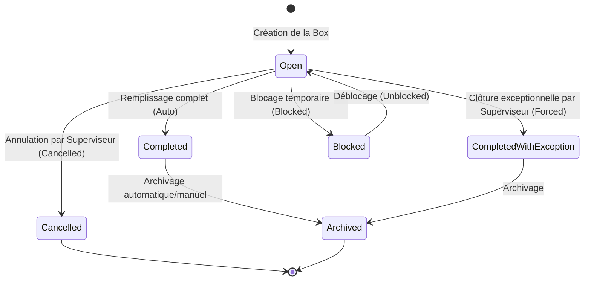

# AGENT.md — Mémoire persistante du projet

## 1. Identité du projet et objectif métier
Le projet **Motherson Box Management** est une application web interne conçue pour la zone de packaging P3 de l'usine Motherson.
Son objectif principal est de permettre aux opérateurs de préparer, suivre et auditer des boxes de packaging contenant des packages de câbles identifiés par codes-barres.
**Valeur fondamentale :** Assurer la traçabilité absolue des boxes de packaging et garantir qu'aucun package de câbles n'est scanné ou affecté à plus d'une box dans l'ensemble du système.

## 2. Périmètre du MVP
Le MVP fonctionne de manière **autonome** :
* **Aucune synchronisation externe :** Pas de connexion avec un ERP ou un MES.
* **Aucun référentiel externe de packages :** Un package de câbles est découvert et enregistré par l'application lors de son premier scan valide.
* **Règle d'unicité globale :** Un package de câbles ne peut être associé qu'à une seule et unique box.
* **Interface en français.**
* **Simulateur de scanner intégré :** Un panel virtuel dans l'UI pour simuler les entrées de scanner de codes-barres USB (keyboard wedge) afin de faciliter le test et la validation sans matériel physique.

## 3. Technologies et versions
* **Framework principal :** ASP.NET Core MVC `[À confirmer dans le dépôt, cible présumée: 8.0]`
* **Accès aux données :** Entity Framework Core `[À confirmer dans le dépôt, cible présumée: 8.0]`
* **Base de données :** SQL Server `[À confirmer dans le dépôt, cible présumée: 2022]`
* **Framework CSS :** Bootstrap `[À confirmer dans le dépôt, cible présumée: 5.3]`
* **Authentification/Autorisation :** Cookie Authentication native d'ASP.NET Core avec revendications (claims) de rôle liées au matricule.

## 4. Architecture MVC et responsabilités des dossiers
L'architecture suit le modèle standard ASP.NET Core MVC. Les responsabilités sont réparties comme suit :
* `[Dossier Racine du projet C# à confirmer]` (ex. `MothersonBoxManagement/` ou directement à la racine)
  * `/Controllers` : Contrôleurs MVC légers (minces). Ils gèrent le routage, valident les ViewModels d'entrée et délèguent la logique métier aux services.
  * `/Models` : Contient exclusivement les ViewModels pour l'affichage et la soumission de formulaires (ex. `LoginViewModel`, `BoxViewModel`, `ScanViewModel`). Les entités de base de données ne doivent jamais être exposées directement aux vues MVC.
  * `/Data` : Contient le `ApplicationDbContext`, les configurations EF Core (`IEntityTypeConfiguration`) et le dossier `/Migrations`.
  * `/Entities` : Entités métier pures mappées en base de données (ex. `User`, `Box`, `BoxPackage`, `BoxAuditLog`).
  * `/Services` : Services métier autonomes contenant toute la logique métier, validations, transactions SQL, gestion des états et appels EF Core (ex. `IBoxService`, `IScanService`, `IUserService`).
  * `/Views` : Pages Razor structurées avec Bootstrap.
  * `/wwwroot` : Fichiers statiques (scripts JS pour le scanner USB, styles CSS, images).

## 5. Conventions de code et de structure
* **Nommage :**
  * `PascalCase` pour les types (classes, interfaces, structs, enums), les méthodes et les propriétés publiques.
  * `camelCase` pour les variables locales et les arguments de méthode.
  * `_camelCase` pour les champs privés en lecture seule (readonly).
* **Nullables :** Activation des *Nullable Reference Types* (`<Nullable>enable</Nullable>`) obligatoire dans les fichiers `.csproj`. Tout avertissement de type nullable doit être résolu proprement (pas de suppression sauvage d'alertes).
* **Asynchronisme :** Utilisation systématique de `async`/`await` pour toutes les opérations d'E/S (accès DB via EF Core, lectures de fichiers). Les méthodes asynchrones doivent accepter et propager un `CancellationToken`. L'utilisation de `.Result` ou `.Wait()` est strictement interdite pour éviter les deadlocks.
* **Injection de dépendances :** Utilisation du conteneur d'injection de dépendances natif d'ASP.NET Core. L'anti-pattern *Service Locator* est interdit.

## 6. Règles métier critiques
* **Distinctivité des codes-barres :** Les codes-barres des boxes et des packages doivent être différenciables par leur format.
  * *Format :* `BOX-YYYYMMDD-XXXXXX` (où `XXXXXX` est un suffixe hexadécimal majuscule de 6 caractères) pour le numéro de box et son code-barres (qui sont identiques). Les packages de câbles commencent généralement par `PKG-` ou un format distinct sans le préfixe `BOX-`.
  * Tout scan d'un code box sur l'écran d'association de package doit être rejeté avec une erreur explicite.
  * Tout scan de package sur l'écran d'accueil ou de recherche de box doit être rejeté avec une erreur explicite.
* **Dimensions en centimètres entiers :** Les dimensions des boxes (`Height`, `Width`, `Depth`) sont stockées sous forme d'entiers strictement positifs (`int`) représentant les centimètres. Les valeurs décimales, nulles ou négatives sont rejetées lors de la saisie et de la validation.
* **Concurrence optimiste :** Les boxes doivent implémenter un mécanisme de concurrence optimiste (`RowVersion` / `byte[]` sous SQL Server) pour empêcher que deux opérateurs n'écrasent leurs modifications simultanément.
* **Immutabilité de l'audit :** Aucun enregistrement dans `BoxAuditLogs` ne peut être modifié, mis à jour ou supprimé. L'accès en écriture se fait uniquement par ajout (Append-Only) via le contexte sécurisé.

## 7. Rôles et autorisations
Les utilisateurs accèdent à l'application via leur identifiant unique (matricule) et leur mot de passe.
Les rôles configurés sont :
1. **Opérateur (`Operator`) :** Création de box, scan de packages, reprise de box ouverte, consultation de son historique personnel. Il ne peut effectuer aucune action d'exception (retrait, transfert, annulation, forçage).
2. **Superviseur (`Supervisor`) :** Possède tous les droits de l'Opérateur, plus les droits d'exception : annuler une box, forcer la clôture avec écart (CompletedWithException), modifier la quantité attendue, retirer/transférer un package, bloquer/débloquer une box ou un package. Motif obligatoire exigé pour chaque exception.
3. **Administrateur / Service IT (`Administrator`) :** Possède tous les droits du Superviseur, plus la gestion des comptes utilisateurs, la consultation du journal d'audit complet et le paramétrage des formats de codes-barres.

## 8. Modèle de données fonctionnel
Toutes les entités clés sont stockées dans des tables uniques.

| Nom de l'entité | Table SQL | Propriétés clés | Relations & Contraintes |
| :--- | :--- | :--- | :--- |
| `User` | `Users` | `Id` (PK), `Matricule` (Unique), `PasswordHash`, `Role` (Enum/String), `IsActive` | - |
| `Box` | `Boxes` | `Id` (PK), `BoxNumber` (Unique), `BarcodeValue` (Unique), `Type` (Enum: Carton, Bois, Plastique), `Height` (int), `Width` (int), `Depth` (int), `ExpectedQuantity`, `CurrentQuantity`, `Status` (Enum), `CreatedByUserId` (FK), `LastModifiedByUserId` (FK), `ClosedByUserId` (FK), `CreatedAt`, `UpdatedAt`, `ClosedAt`, `RowVersion` (ConcurrencyToken) | Relations avec `Users` (Créateur, Modificateur, Clôture) ; Relation One-to-Many avec `BoxPackages`. |
| `BoxPackage` | `BoxPackages` | `Id` (PK), `BoxId` (FK), `PackageBarcode` (Unique SQL Global), `ScannedByUserId` (FK), `ScannedAt` | FK vers `Boxes`. **Contrainte d'unicité SQL stricte sur `PackageBarcode`** au niveau de la base pour interdire le double scan sur deux boxes différentes. |
| `BoxAuditLog` | `BoxAuditLogs` | `Id` (PK), `BoxId` (FK, Nullable), `ActionType` (String), `UserId` (FK), `Timestamp`, `WorkstationName`, `DetailsJson` (Contient motif, valeurs avant/après, écarts, etc.) | Table append-only sans droits d'édition/suppression applicatifs. |

## 9. État des migrations EF Core
Cette section récapitule l'historique des migrations EF Core appliquées.

| Nom de la migration | Objectif principal | Statut (Appliquée/En attente) | Impact sur les données | Rollback / Notes |
| :--- | :--- | :--- | :--- | :--- |
| `20260702125840_InitialSchema` | Création des tables `Users`, `Boxes`, `BoxPackages`, `BoxAuditLogs` | Appliquée | Initialisation du schéma | - |
| `20260702143042_UseIntegerBoxDimensions` | Conversion des dimensions `Height`, `Width` et `Depth` de la table `Boxes` de double (float) vers entier (int) | Appliquée | Conversion de colonnes | - |

*Note réglementaire :* Aucun changement direct de schéma en base de données n'est toléré sans passer par une migration EF Core explicite.

## 10. Contraintes SQL essentielles
* **Unicité globale du package :** `ALTER TABLE BoxPackages ADD CONSTRAINT UQ_BoxPackages_PackageBarcode UNIQUE (PackageBarcode);`
  * Cette contrainte doit être explicitement déclarée dans la configuration EF Core via `.HasIndex(p => p.PackageBarcode).IsUnique();`.
* **Index de recherche :** Un index non-clustered doit être posé sur `Boxes.BarcodeValue` pour accélérer les redirections depuis la page d'accueil.
* **Type RowVersion :** La colonne `RowVersion` de la table `Boxes` doit être de type `rowversion` (ou `timestamp` SQL Server) et configurée comme jeton de concurrence dans EF Core : `.IsRowVersion()`.

## 11. Statuts de box et transitions autorisées
Une box suit la machine à états suivante :



*Règles strictes :*
* Une box au statut `Completed`, `CompletedWithException`, `Cancelled`, `Archived` ou `Blocked` refuse systématiquement tout nouveau scan de package.
* Les packages associés à une box au statut `Cancelled` ne sont pas libérés automatiquement ; ils restent rattachés à la box annulée pour garantir l'historique (une action explicite de désaffectation par un superviseur est requise pour les libérer).

## 12. Parcours de scan de box et de package
### A. Scan de box (Accès direct depuis la page d'accueil)
1. L'utilisateur positionne le focus dans le champ "Scanner une box" de l'accueil.
2. Le scanner USB lit le code-barres de la box (format `BOX-...`) et valide l'entrée.
3. Le système intercepte la saisie, valide le format du code box, recherche la box correspondante dans la base de données.
4. Si la box existe et est `Open` : redirection vers la page de préparation et d'association de packages.
5. Si la box existe et est fermée (`Completed`, `CompletedWithException`, `Cancelled`, `Archived`) ou `Blocked` : redirection vers la vue de détail en lecture seule (avec avertissement pour les boxes bloquées).
6. Si la box n'existe pas : affichage d'un message d'erreur clair "Box inconnue".

### B. Scan de package (Depuis l'écran de préparation)
1. L'opérateur scanne le code-barres d'un package (format `PKG-...`).
2. Le système intercepte le code et exécute les vérifications suivantes dans une transaction SQL isolée :
   * Validation du format : le code scanné doit être un package et non une box.
   * État de la box : elle doit être au statut `Open`.
   * Unicité : vérification que le code-barres n'existe pas déjà dans la table `BoxPackages` (qu'il soit associé à cette box ou à une autre).
   * Quantité : vérification que la quantité attendue n'est pas déjà atteinte.
3. Si toutes les validations passent :
   * Création de la ligne dans `BoxPackages` avec l'ID utilisateur de l'opérateur connecté et l'horodatage.
   * Incrémentation de `CurrentQuantity` sur la box.
   * Ajout d'une ligne d'audit `PackageScanned`.
   * Si `CurrentQuantity` devient égale à `ExpectedQuantity` : modification automatique du statut de la box à `Completed` et écriture d'un log d'audit `BoxCompletedAuto`.
4. Si une validation échoue : rejet immédiat du scan, rollback de la transaction, écriture d'une entrée d'audit `PackageRejected` (pour traçabilité des tentatives d'erreur ou de fraude) et affichage d'un message d'erreur rouge explicite à l'écran.

## 13. Commandes utiles
*(Commandes à exécuter à la racine de la solution C#)*
* **Restauration des dépendances :**
  ```powershell
  dotnet restore
  ```
* **Compilation du projet :**
  ```powershell
  dotnet build
  ```
* **Exécution des tests unitaires et d'intégration :**
  ```powershell
  dotnet test
  ```
* **Ajout d'une migration EF Core :**
  ```powershell
  dotnet ef migrations add <NomMigration> --project <CheminProjetDataOrWeb> --startup-project <CheminProjetWeb>
  ```
* **Mise à jour de la base de données :**
  ```powershell
  dotnet ef database update --project <CheminProjetDataOrWeb> --startup-project <CheminProjetWeb>
  ```

## 14. Configuration locale sécurisée
La configuration de développement s'effectue via le fichier `appsettings.Development.json` ou l'outil Secrets Manager de .NET (`dotnet user-secrets`).
**Variables d'environnement requises (Placeholders sécurisés) :**
* `ConnectionStrings__DefaultConnection` : Chaîne de connexion SQL Server locale (ex. `Server=(localdb)\\mssqllocaldb;Database=MothersonBoxManagement;Trusted_Connection=True;MultipleActiveResultSets=true`).
* `Authentication__CookieName` : Nom du cookie de session (ex. `Motherson.BoxManagement.Auth`).
* `Authentication__ExpireTimeSpanMinutes` : Durée de validité de la session (ex. `60`).

> [!CAUTION]
> Ne jamais commiter de secrets de production (vrais mots de passe, vraies chaînes de connexion de production) dans le code source ou dans les dépôts Git.

## 15. Routes et Endpoints MVC principaux
* `/Account/Login` : Écran de connexion (POST pour authentifier).
* `/Account/Logout` : Déconnexion de la session.
* `/` ou `/Home/Index` : Tableau de bord principal. Contient le champ "Scanner une box" et la liste des boxes actives.
* `/Box/Create` : Formulaire de création de box (Opérateur/Superviseur/Admin).
* `/Box/Prepare/{id}` : Écran de scan de packages pour une box ouverte (Opérateur/Superviseur/Admin). Contient le simulateur de scan virtuel.
* `/Box/Details/{id}` : Vue en lecture seule de la box, des packages scannés et de l'historique d'audit associé.
* `/Box/Scan` : Action standard de scan de package (POST, Opérateur/Superviseur/Admin).
* `/Box/ScanAjax` : Action AJAX de scan de package (POST, Opérateur/Superviseur/Admin, retourne du JSON).
* `/Box/Cancel/{id}` : Action d'annulation (POST, Superviseur/Admin uniquement, motif obligatoire).
* `/Box/ForceClose/{id}` : Action de clôture avec écart (POST, Superviseur/Admin uniquement, motif obligatoire).
* `/Box/Transfer` : Action de transfert de package (POST, Superviseur/Admin uniquement, motif obligatoire).
* `/Box/Block/{id}` / `/Box/Unblock/{id}` : Actions de blocage/déblocage (POST, Superviseur/Admin uniquement, motif obligatoire).

## 16. Packages NuGet significatifs et justification
* `Microsoft.EntityFrameworkCore.SqlServer` : Provider EF Core officiel pour SQL Server (mandaté).
* `Microsoft.EntityFrameworkCore.Design` & `Microsoft.EntityFrameworkCore.Tools` : Nécessaires pour la génération des migrations et la gestion de la base de données en ligne de commande.

## 17. Journal des décisions d'architecture (ADR léger)
Toute décision d'architecture significative doit être consignée ici.

| Date | Décision | Contexte | Raisons | Impact | Statut |
| :--- | :--- | :--- | :--- | :--- | :--- |
| 2026-07-02 | Tables uniques pour Boxes et Packages | Cahier des charges spécifiant d'éviter les tables dynamiques par box. | Facilité de recherche, d'indexation, de rapports globaux et d'audits. | Schéma relationnel standard simple et performant. | **Validé** |
| 2026-07-02 | Cookie Authentication sans ASP.NET Identity | Identification par matricule interne simple, sans inscription publique ni flux OAuth. | Plus léger et aligné sur le besoin de validation simple contre la table `Users`. | Moins de tables système à maintenir, schéma `Users` entièrement sous contrôle. | **Validé** |
| 2026-07-02 | Intercepteur EF Core pour l'audit | Besoin d'un historique append-only, immuable et automatique pour toutes les opérations. | Centralise l'audit dans `SaveChanges` / `SaveChangesAsync` pour garantir qu'aucune modification n'échappe à la journalisation. | Implémentation propre découplée des contrôleurs MVC. | **Validé** |

## 18. Hypothèses et points à valider
* **Format précis des codes-barres :** Les préfixes exacts (`BOX-` et `PKG-`) doivent être validés avec les équipes de production de la zone P3.
* **Matériel de scan :** Le comportement du scanner USB (keyboard wedge avec envoi automatique de la touche `Enter` en fin de saisie) doit être testé sur les terminaux cibles de l'usine.
* **Volume de données :** Fréquence d'archivage des boxes pour éviter de ralentir la table `BoxPackages` à long terme.

## 19. Risques et dette technique
* **Risque de double scan concurrent :** Deux opérateurs scannant le même code-barres de package au même instant sur deux boxes différentes.
  * *Mitigation :* Contrainte d'unicité SQL stricte en base de données gérée par SQL Server pour lever une exception de concurrence au niveau de la transaction.
* **Secrets dans le dépôt :** Risque de fuite des chaînes de connexion lors des commits de configuration.
  * *Mitigation :* Utilisation systématique de `appsettings.Development.json` local ignoré par Git (ou contenant uniquement des placeholders) et configuration via variables d'environnement.

## 20. Intégration et règles de synchronisation avec GSD Core
* L'agent doit toujours synchroniser ses tâches avec le cycle GSD Core.
* Toute tâche commencée doit être marquée `En cours` dans `TODO.md` avec sa référence de phase/plan GSD correspondante.
* Les artefacts internes de GSD Core (`.planning/`) ne doivent jamais être modifiés manuellement en dehors des commandes ou processus GSD.
* L'état d'avancement des tâches doit être mis à jour régulièrement dans `TODO.md` pour refléter fidèlement le statut réel du dépôt.

## 21. Checklist obligatoire avant toute modification
1. Lire le fichier `.planning/PROJECT.md` et `.planning/ROADMAP.md` pour identifier la phase active.
2. Vérifier `AGENT.md` pour comprendre les règles métier liées aux entités modifiées.
3. Consulter `TODO.md` et s'assurer que la tâche est marquée `En cours` (ou la créer si tâche rapide/corrective).
4. S'assurer que le workspace est propre (`git status` sans modifications inattendues).

## 22. Checklist obligatoire après toute modification
1. Lancer la compilation locale (`dotnet build`) et corriger tous les avertissements/erreurs.
2. Lancer les tests unitaires (`dotnet test`) et s'assurer qu'aucun test ne régresse.
3. En cas de modification de schéma de base de données : générer la migration EF Core correspondante et appliquer la migration localement pour tester.
4. Mettre à jour `AGENT.md` si une entité, une relation, un statut ou une décision d'architecture a changé.
5. Mettre à jour `TODO.md` en passant la tâche à `Terminé` ou `En revue`.
6. Rédiger un message de commit conforme aux Conventional Commits.

---
> **Règle d'or :** Toute modification d'entité, de relation, de migration, de contrainte SQL, d'index, de règle de persistance, de statut métier, d'autorisation, de route MVC, de package NuGet ou de décision d'architecture doit entraîner la mise à jour de `AGENT.md`.
