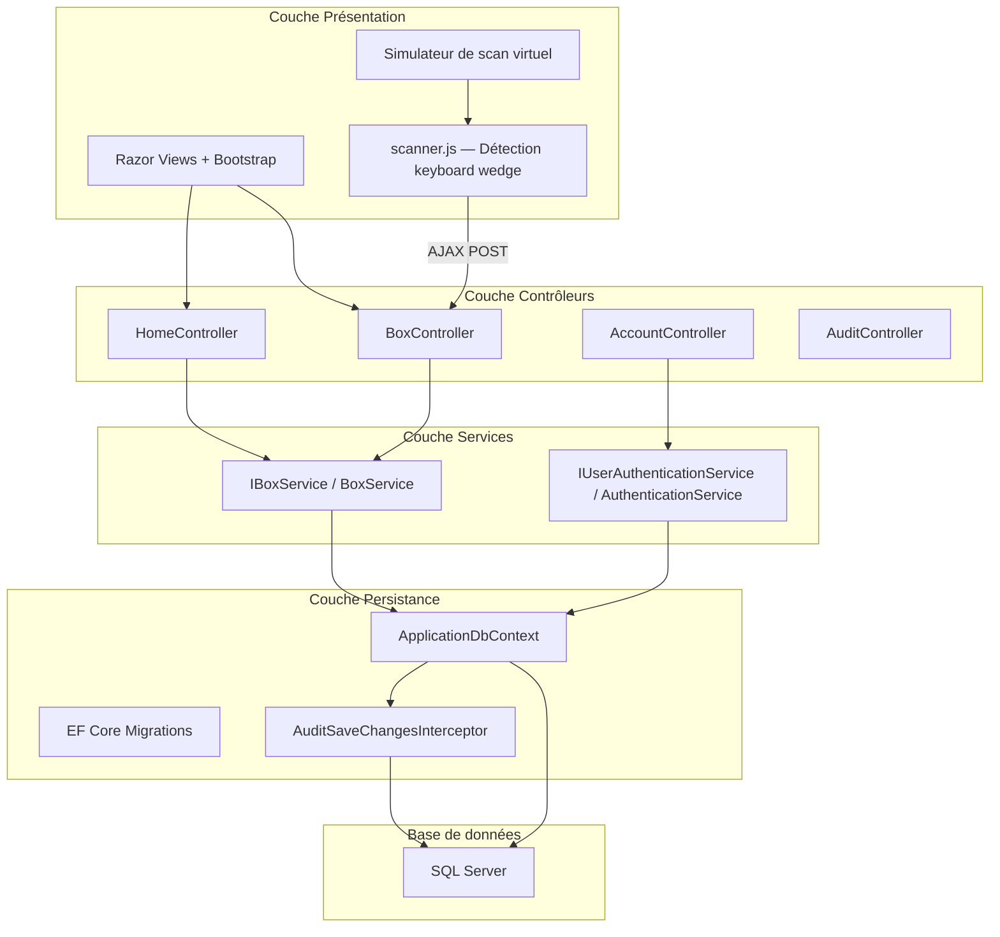
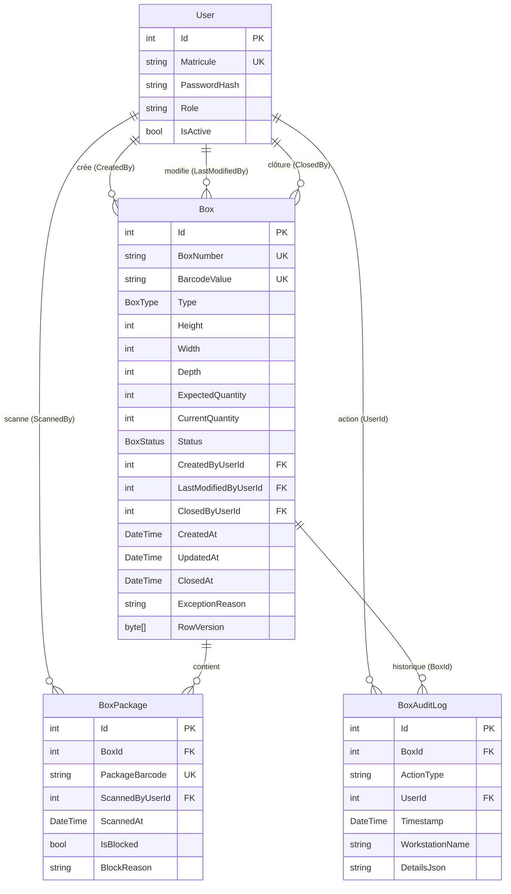
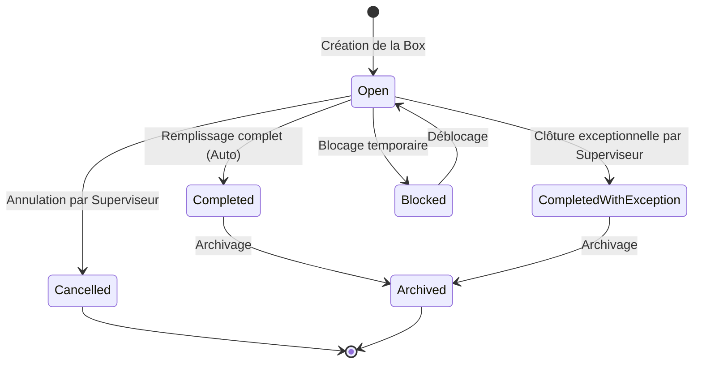

<!-- generated-by: gsd-doc-writer -->
---
title: Architecture
sidebar_position: 2
description: Architecture technique du projet Motherson Box Management
---

# Architecture — Motherson Box Management

## Vue d'ensemble

Motherson Box Management est une application web interne ASP.NET Core MVC conçue pour la zone de packaging P3 de l'usine Motherson. Elle permet aux opérateurs de créer des boxes de packaging, y scanner des packages de câbles identifiés par codes-barres, et d'assurer une traçabilité complète via un journal d'audit append-only. L'application fonctionne de manière autonome, sans synchronisation avec un ERP ou MES externe.

## Diagramme des composants



## Flux de données — Parcours typique

### 1. Connexion
1. L'utilisateur accède à `/Account/Login`.
2. `AccountController` délègue l'authentification à `IUserAuthenticationService`.
3. Le service vérifie le matricule et le hash du mot de passe (`IPasswordHasher<User>`).
4. Un cookie d'authentification est émis avec les revendications de rôle.

### 2. Scan de box (page d'accueil)
1. L'opérateur positionne le focus dans le champ "Scanner une box" sur `/` (`HomeController`).
2. Le scanner USB (keyboard wedge) envoie la saisie + touche `Enter`.
3. `scanner.js` intercepte les frappes rapides (>3 caractères, délai <50ms entre touches) et soumet via AJAX POST vers `/Box/Scan` ou `/Box/ScanAjax`.
4. `BoxController.Scan` cherche la box par `BarcodeValue`.
5. Si la box est `Open` → redirection vers `/Box/Prepare/{barcode}`.
6. Si la box est fermée ou bloquée → vue en lecture seule `/Box/Details/{barcode}`.
7. Si inconnue → message d'erreur "Box inconnue".

### 3. Scan de package (écran de préparation)
1. L'opérateur scanne le code-barres d'un package sur `/Box/Prepare/{barcode}`.
2. `scanner.js` envoie un AJAX POST vers `/Box/ScanAjax` avec le `boxId`, le `boxBarcode` et le `barcode` du package.
3. `BoxController.ScanAjax` délègue à `IBoxService.ScanPackageAsync`.
4. Le service exécute dans une transaction SQL :
   - Validation du format (doit être un package, pas une box).
   - Vérification que la box est `Open`.
   - Vérification de l'unicité du `PackageBarcode` dans `BoxPackages` (contrainte SQL unique).
   - Vérification que la quantité attendue n'est pas atteinte.
5. Si valide : création de `BoxPackage`, incrémentation de `CurrentQuantity`, log d'audit `PackageScan`.
6. Si `CurrentQuantity == ExpectedQuantity` → statut automatique `Completed` + audit `BoxCompletedAuto`.
7. Si invalide : rollback, log d'audit `PackageRejected`, message d'erreur.

## Diagramme des entités



## Machine à états des boxes

Une box suit le cycle de vie suivant :



**Règles strictes :**
- Une box `Completed`, `CompletedWithException`, `Cancelled`, `Archived` ou `Blocked` refuse tout nouveau scan de package.
- Les packages d'une box `Cancelled` restent rattachés (pas de libération automatique).
- Les transitions vers `Cancelled`, `CompletedWithException`, `Block/Unblock` nécessitent un motif obligatoire et un rôle Superviseur ou Administrator.

## Structure du répertoire

```
MothersonBoxManagement/
├── Controllers/           # Contrôleurs MVC légers
│   ├── AccountController.cs
│   ├── AuditController.cs
│   ├── BoxController.cs
│   └── HomeController.cs
├── Entities/              # Entités métier pures (mappées EF Core)
│   ├── Box.cs
│   ├── BoxAuditLog.cs
│   ├── BoxPackage.cs
│   ├── BoxStatus.cs       # Enum : Open, Completed, CompletedWithException, Cancelled, Archived, Blocked
│   ├── BoxType.cs         # Enum : Carton, Bois, Plastique
│   └── User.cs
├── Models/                # ViewModels pour les vues Razor
│   └── ErrorViewModel.cs
├── ViewModels/            # ViewModels de transfert de données
│   ├── CreateBoxViewModel.cs
│   ├── HomeViewModel.cs
│   ├── LoginViewModel.cs
│   └── PrepareViewModel.cs
├── Services/              # Logique métier isolée
│   ├── IBoxService.cs
│   ├── BoxService.cs
│   ├── IAuthenticationService.cs
│   └── AuthenticationService.cs
├── Data/                  # Accès aux données
│   ├── ApplicationDbContext.cs    # Contexte EF Core
│   ├── DbInitializer.cs          # Seeding initial
│   ├── Interceptors/
│   │   └── AuditSaveChangesInterceptor.cs  # Audit append-only
│   └── Dtos/                      # Objets de transfert pour les services
│       ├── BoxDetailsDto.cs
│       ├── BoxListItemDto.cs
│       ├── CreateBoxDto.cs
│       └── ScanResult.cs
├── Migrations/            # Migrations EF Core
├── Views/                 # Pages Razor
│   ├── Account/
│   ├── Audit/
│   ├── Box/
│   ├── Home/
│   └── Shared/
└── wwwroot/               # Fichiers statiques
    ├── css/
    ├── js/
    │   ├── scanner.js     # Détection keyboard wedge + scan AJAX
    │   └── site.js
    └── lib/               # Dépendances client (Bootstrap, etc.)
```

**Justification :** L'architecture MVC classique sépare clairement les responsabilités. Les contrôleurs restent minces (routage + validation des ViewModels), la logique métier vit dans les services, et les entités ne sont jamais exposées directement aux vues.

## Format des codes-barres

Deux formats distincts garantissent qu'un scan de box ne peut être confondu avec un scan de package :

| Type | Format | Exemple | Validation |
| :--- | :--- | :--- | :--- |
| **Box** | `BOX-YYYYMMDD-XXXXXX` | `BOX-20260702-A1B2C3` | Préfixe `BOX-`, date, suffixe hex 6 caractères majuscules |
| **Package** | `PKG-...` (ou format distinct sans préfixe `BOX-`) | `PKG-12345678` | Tout code ne commençant pas par `BOX-` |

Tout scan de code `BOX-*` sur l'écran de préparation de package est rejeté. Tout scan de code non-`BOX-*` sur l'écran d'accueil est rejeté.

## Contrôle de concurrence

La concurrence optimiste est implémentée via la colonne `RowVersion` (type `byte[]` mappé en `rowversion` SQL Server) sur l'entité `Box`. Cette colonne est configurée comme jeton de concurrence dans EF Core via `.IsRowVersion()`.

Lorsqu'un opérateur tente de modifier une box qui a été modifiée entre-temps par un autre, EF Core lève une `DbUpdateConcurrencyException`. Le service traite cette exception et restitue un message d'erreur explicite à l'utilisateur.

## Mécanisme d'audit

L'audit est centralisé dans `AuditSaveChangesInterceptor`, un intercepteur EF Core qui hook les appels à `SaveChanges` / `SaveChangesAsync` :

1. **Détection des modifications** : L'intercepteur parcourt le `ChangeTracker` pour les entités `Added`, `Modified` ou `Deleted` (en excluant `BoxAuditLog` pour éviter la récursion).
2. **Identification de l'utilisateur** : Recherche du `ClaimTypes.NameIdentifier` dans le contexte HTTP. Fallback sur l'utilisateur système (matricule `AD001`) pour les tâches en arrière-plan.
3. **Collecte des changements** : Pour chaque entrée modifiée, les valeurs originales et actuelles sont collectées. Seules les propriétés réellement modifiées sont enregistrées.
4. **Écriture** : Une ligne `BoxAuditLog` est ajoutée avec le type d'action (`Insert`, `Update`, `Delete`, `PackageScan`), l'horodatage, le nom du poste de travail, et un `DetailsJson` contenant les changements sérialisés en JSON.
5. **Immutabilité** : La table `BoxAuditLogs` est append-only. Aucune opération UPDATE ou DELETE n'est autorisée sur cette table.

Le registrateur de l'intercepteur dans `Program.cs` :

```csharp
builder.Services.AddScoped<AuditSaveChangesInterceptor>();
builder.Services.AddDbContext<ApplicationDbContext>((sp, options) =>
{
    options.UseSqlServer(builder.Configuration.GetConnectionString("DefaultConnection"));
    options.AddInterceptors(sp.GetRequiredService<AuditSaveChangesInterceptor>());
});
```

## Authentification et autorisation

- **Mécanisme** : Cookie Authentication natif d'ASP.NET Core (pas d'ASP.NET Identity).
- **Identification** : Matricule unique + mot de passe hashé (`IPasswordHasher<User>`).
- **Rôles** : `Operator`, `Supervisor`, `Administrator` — appliqués via `[Authorize(Roles = "...")]` sur les actions MVC.
- **Durée de session** : 60 minutes avec expiration glissante (`SlidingExpiration`).

## Dépendances NuGet significatifs

| Package | Rôle |
| :--- | :--- |
| `Microsoft.EntityFrameworkCore.SqlServer` | Provider EF Core pour SQL Server |
| `Microsoft.EntityFrameworkCore.Design` | Outils de migration en ligne de commande |
