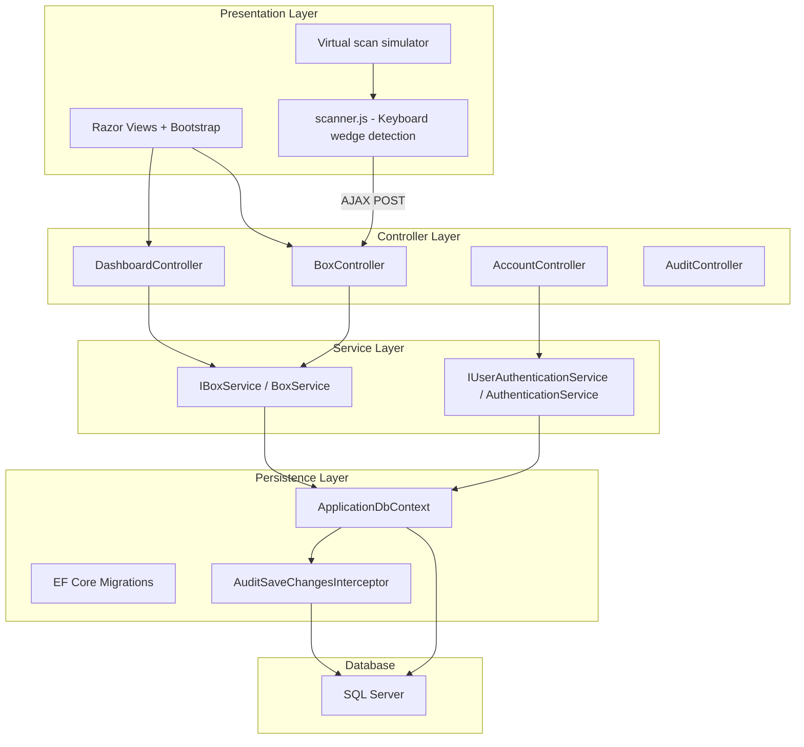
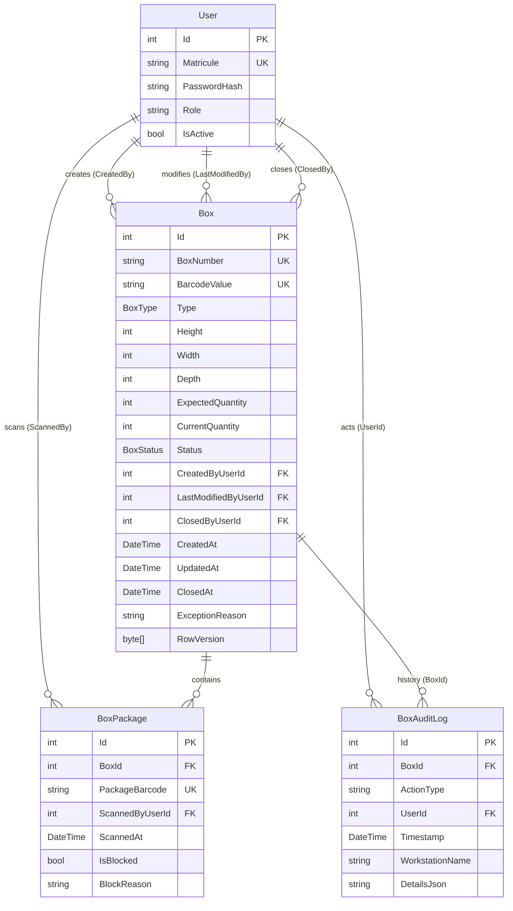
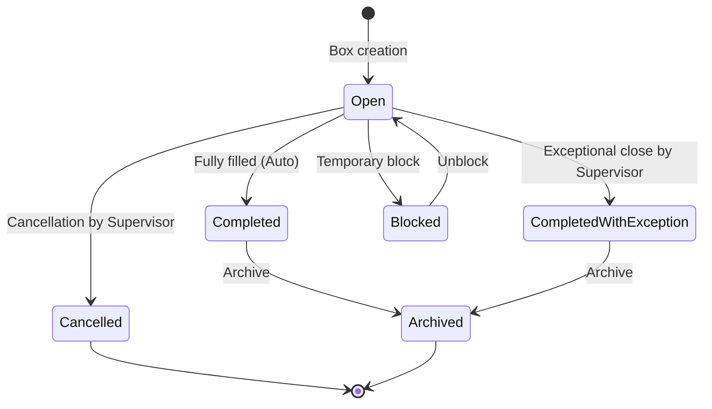

<!-- generated-by: gsd-doc-writer -->
---
title: Architecture
sidebar_position: 2
description: Technical architecture of the Motherson Box Management project
---

# Architecture - Motherson Box Management

## Overview

Motherson Box Management is an internal ASP.NET Core MVC web application for the P3 packaging area at the Motherson plant. It lets operators create packaging boxes, scan cable packages identified by barcodes into them, and keep full traceability through an append-only audit log. The application works independently, with no sync to an external ERP or MES.

## Component Diagram



## Data Flow - Typical User Journey

### 1. Sign in
1. The user opens `/Account/Login`.
2. `AccountController` delegates authentication to `IUserAuthenticationService`.
3. The service checks the matricule and password hash (`IPasswordHasher<User>`).
4. An authentication cookie is issued with role claims.

### 2. Box scan from the dashboard
1. The operator focuses the "Scan a box" field on `/`.
2. The USB scanner (keyboard wedge) sends the input plus `Enter`.
3. `scanner.js` captures fast keystrokes and submits them through AJAX POST.
4. `BoxController` looks up the box by `BarcodeValue`.
5. If the box is `Open`, the user is redirected to `/Box/Prepare/{barcode}`.
6. If the box is closed or blocked, the user is redirected to the read-only `/Box/Details/{barcode}` view.
7. If the box is unknown, a clear error message is shown.

### 3. Package scan from the preparation screen
1. The operator scans a package barcode on `/Box/Prepare/{barcode}`.
2. `scanner.js` sends an AJAX POST to `/Box/ScanAjax` with `boxId`, `boxBarcode`, and the package `barcode`.
3. `BoxController.ScanAjax` delegates the work to the package scan service.
4. The service runs a SQL transaction that checks:
   - format validation (must be a package, not a box),
   - the box is `Open`,
   - `PackageBarcode` is unique across `BoxPackages`,
   - expected quantity is not already reached.
5. If valid, a `BoxPackage` is created, `CurrentQuantity` is incremented, and a `PackageScan` audit log is written.
6. If `CurrentQuantity == ExpectedQuantity`, the box automatically changes to `Completed` and a `BoxCompletedAuto` audit log is written.
7. If invalid, the transaction is rolled back, a `PackageRejected` audit entry is written, and a clear error message is shown.

## Entity Diagram



## Box State Machine

A box follows this lifecycle:



**Strict rules:**
- A `Completed`, `CompletedWithException`, `Cancelled`, `Archived`, or `Blocked` box rejects any new package scan.
- Packages in a `Cancelled` box stay attached to that box and are not released automatically.
- Transitions to `Cancelled`, `CompletedWithException`, `Block`, and `Unblock` require a reason and Supervisor or Administrator role.

## Directory Structure

```
MothersonBoxManagement/
├── Controllers/           # Thin MVC controllers
│   ├── AccountController.cs
│   ├── AuditController.cs
│   ├── BoxController.cs
│   ├── DashboardController.cs
│   └── UsersController.cs
├── Entities/              # Pure EF Core-mapped business entities
│   ├── Box.cs
│   ├── BoxAuditLog.cs
│   ├── BoxPackage.cs
│   ├── BoxStatus.cs
│   ├── BoxType.cs
│   └── User.cs
├── Models/                # Shared Razor view models
│   └── ErrorViewModel.cs
├── ViewModels/            # ViewModels used by screens/forms
├── Services/              # Isolated business logic
├── Data/                  # Data access
│   ├── ApplicationDbContext.cs
│   ├── DbInitializer.cs
│   ├── Interceptors/
│   └── Dtos/
├── Migrations/            # EF Core migrations
├── Views/                 # Razor pages
└── wwwroot/               # Static files
```

**Why this structure:** The standard MVC architecture keeps responsibilities clear. Controllers stay thin, business logic lives in services, and entities are never exposed directly to views.

## Barcode Formats

Two distinct formats make sure a box scan cannot be confused with a package scan:

| Type | Format | Example | Validation |
| :--- | :--- | :--- | :--- |
| **Box** | `BOX-YYYYMMDD-XXXXXX` | `BOX-20260702-A1B2C3` | `BOX-` prefix, date, 6-character uppercase hex suffix |
| **Package** | `PKG-...` (or another distinct format without `BOX-`) | `PKG-12345678` | Any code that does not start with `BOX-` |

Any `BOX-*` code scanned on the package preparation screen is rejected. Any non-`BOX-*` code scanned on the dashboard box lookup screen is rejected.

## Concurrency Control

Optimistic concurrency is implemented with the `RowVersion` column (`byte[]`, mapped to SQL Server `rowversion`) on the `Box` entity. EF Core uses `.IsRowVersion()` to treat it as a concurrency token.

If an operator tries to update a box that was already changed by another operator, EF Core throws `DbUpdateConcurrencyException`. The service catches this and returns a clear user-facing error message.

## Audit Mechanism

Audit logging is centralized in `AuditSaveChangesInterceptor`, an EF Core interceptor that hooks into `SaveChanges` / `SaveChangesAsync`:

1. **Detect changes:** The interceptor scans the `ChangeTracker` for `Added`, `Modified`, and `Deleted` entities, excluding `BoxAuditLog` to avoid recursion.
2. **Identify the user:** It looks up `ClaimTypes.NameIdentifier` from the HTTP context, with fallback to a system user for background work.
3. **Collect changes:** It records original and current values, keeping only properties that actually changed.
4. **Write audit rows:** A `BoxAuditLog` record is added with the action type, timestamp, workstation name, and `DetailsJson`.
5. **Keep immutability:** `BoxAuditLogs` is append-only. No UPDATE or DELETE is allowed on that table.

Registration in `Program.cs`:

```csharp
builder.Services.AddScoped<AuditSaveChangesInterceptor>();
builder.Services.AddDbContext<ApplicationDbContext>((sp, options) =>
{
    options.UseSqlServer(builder.Configuration.GetConnectionString("DefaultConnection"));
    options.AddInterceptors(sp.GetRequiredService<AuditSaveChangesInterceptor>());
});
```

## Authentication and Authorization

- **Mechanism:** Native ASP.NET Core Cookie Authentication (no ASP.NET Identity).
- **Identification:** Unique matricule + hashed password (`IPasswordHasher<User>`).
- **Roles:** `Operator`, `Supervisor`, `Administrator`, enforced through `[Authorize(Roles = "...")]`.
- **Session lifetime:** 60 minutes with sliding expiration.

## Important NuGet Dependencies

| Package | Role |
| :--- | :--- |
| `Microsoft.EntityFrameworkCore.SqlServer` | EF Core SQL Server provider |
| `Microsoft.EntityFrameworkCore.Design` | Command-line migration tooling |
