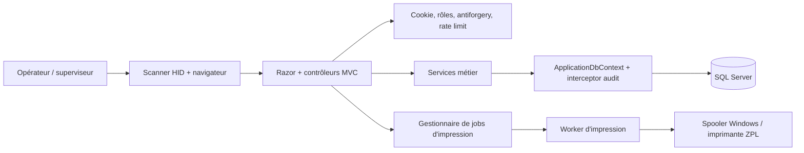
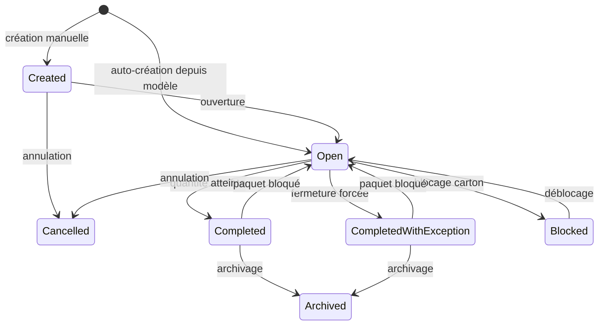

# 01 — Compréhension du projet et architecture

## Synthèse

Motherson Box Management est une application industrielle autonome de suivi de conditionnement pour la zone P3. Elle permet à des opérateurs authentifiés de créer ou auto-créer des cartons à partir de modèles, scanner des paquets câble, imprimer des étiquettes et conserver une traçabilité des opérations sensibles. Le périmètre annoncé est explicitement indépendant d'un ERP/MES (`README.md:1-13`, `docs/ARCHITECTURE.md:10-13`).

La solution contient une application ASP.NET Core MVC .NET 8 et un projet xUnit (`README.md:97-109`). L'interface est rendue par Razor/Bootstrap et complétée par du JavaScript pour les scanners HID. La persistance repose sur EF Core et SQL Server. L'authentification est un cookie applicatif avec les rôles Operator, Supervisor et Administrator (`README.md:5-13`; `MothersonBoxManagement/Program.cs:22-37`).

## Composants et responsabilités observés

| Couche | Responsabilités | Preuves |
|---|---|---|
| Présentation | vues Razor, saisie/scanner, affichage dashboard et opérations | `MothersonBoxManagement/Views/`; `MothersonBoxManagement/wwwroot/js/scanner.js` |
| Contrôleurs | endpoints MVC, autorisation, résolution du poste, orchestration | `MothersonBoxManagement/Controllers/BoxController.cs:167-252`; `BoxOperationsController.cs:10-222` |
| Métier | cycle de vie carton, scan, modèles, utilisateurs, audit, impression | `MothersonBoxManagement/Services/IBoxLifecycleService.cs:5-15`; `IPackageScanService.cs`; `BoxTemplateService.cs:21-176` |
| Données | mapping EF, contraintes, index, migrations, interception d'audit | `ApplicationDbContext.cs:24-125`; `Data/Interceptors/AuditSaveChangesInterceptor.cs:175-214` |
| Impression | page HTML/QR et boîte de dialogue du navigateur | `PrintController.PrintClient`; `Views/Box/Print.cshtml` |

## Flux métier principaux

1. **Création manuelle** : un carton est créé en état `Created`, puis ouvert par une action superviseur. La transition `Created -> Open` est contrôlée dans `BoxService.cs:210-227`.
2. **Auto-création par paquet** : le code paquet sélectionne le modèle actif au préfixe le plus long, ouvre une transaction relationnelle, crée le carton directement en état `Open`, crée éventuellement le job d'impression puis effectue le premier scan. Un échec du scan provoque le rollback (`BoxTemplateService.cs:124-175`; `BoxController.cs:181-267`).
3. **Scan dans un carton** : validation du format, vérification d'idempotence/doublon, état et capacité, insertion, incrément du compteur et complétion automatique dans une transaction avec trois tentatives sur conflit optimiste (`PackageScanService.cs:30-229`).
4. **Exceptions superviseur** : annulation, fermeture forcée, changement de quantité, blocage, archivage, blocage/retrait/transfert de paquet sont exposés par un contrôleur réservé Supervisor/Administrator (`BoxOperationsController.cs:10-222`).
5. **Impression** : les jobs persistés sont consommés par un worker; le spooler réel est Windows et une implémentation factice couvre les autres environnements.

## Modèle d'état constaté

Les états sont définis dans `Entities/BoxStatus.cs:3-11`. Les gardes sont réparties dans `BoxService.cs:210-648` et le scan refuse tout carton autre que `Open` (`PackageScanService.cs:125-140`).

## Concurrence et intégrité

- `Boxes.RowVersion` est un jeton SQL Server `rowversion` (`ApplicationDbContext.cs:63-65`).
- Les identifiants carton sont uniques; le paquet actif est protégé par un index unique filtré sur `IsRemoved = 0` (`ApplicationDbContext.cs:63-65,97-109`).
- Une clé `ScanRequestId` unique et filtrée permet de restaurer le résultat d'un rejeu (`ApplicationDbContext.cs:103-109`; `PackageScanService.cs:57-71`).
- Les quantités et dimensions sont protégées par des contraintes CHECK (`ApplicationDbContext.cs:48-60`).
- Un test d'intégration SQL Server couvre migrations, contraintes et double scan concurrent, mais il est ignoré sans variable d'environnement dédiée (`SqlServerIntegrationTests.cs:11-17,41-135`).

## Limites architecturales constatées

### ARCH-001 — Documentation d'architecture désynchronisée — Moyenne

Le document d'architecture décrit encore `/Box/Prepare`, `/Box/ScanAjax`, `IUserAuthenticationService`, une unicité globale et des champs d'entité anciens (`docs/ARCHITECTURE.md:31-34,68-88,102-149`). Le code actuel utilise notamment `/Box/AutoScanPackage` et `/Box/AssociatePackage`, un index paquet filtré autorisant la réassociation après retrait et plusieurs services spécialisés (`BoxController.cs:167-171,270-297`; `ApplicationDbContext.cs:97-109`). Cette divergence peut induire en erreur l'exploitation, les mainteneurs et les futurs tests de recette.

### ARCH-002 — Service métier central fortement couplé — Faible

`BoxService` concentre requêtes, cycle de vie et corrections de paquets dans 651 lignes, tout en implémentant quatre interfaces. Les interfaces séparent les contrats mais partagent la même implémentation et le même contexte (`BoxService.cs:9`; `IBoxQueryService.cs:5-12`; `IBoxLifecycleService.cs:5-15`; `IBoxPackageService.cs:5-12`). Le risque immédiat est limité, mais le rayon d'impact des évolutions métier reste élevé.

### ARCH-003 — Orchestration métier et transactionnelle dans le contrôleur — Moyenne

`AutoScanPackage` interroge directement `ApplicationDbContext`, démarre/annule la transaction, crée le carton, le job d'impression et lance le scan (`BoxController.cs:181-267`). Ce flux critique n'est donc pas encapsulé derrière un service applicatif unique. Cela rend les garanties atomiques plus difficiles à réutiliser hors MVC et augmente le risque de divergence lors d'un futur endpoint/API.

## Éléments non vérifiés

Topologie réseau réelle, certificat/TLS, compte de service, imprimantes et pilotes réels, DNS, NTP, pare-feu, volumétrie de production et intégration avec les procédures usine : **non vérifiés dans le dépôt**.
