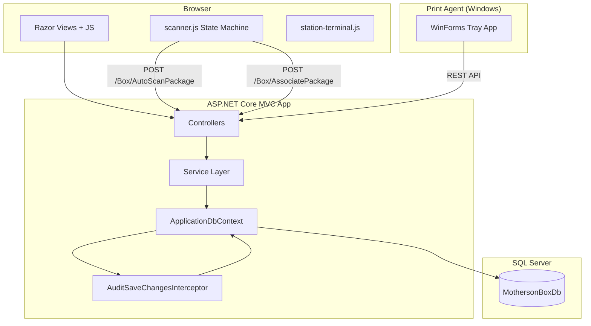
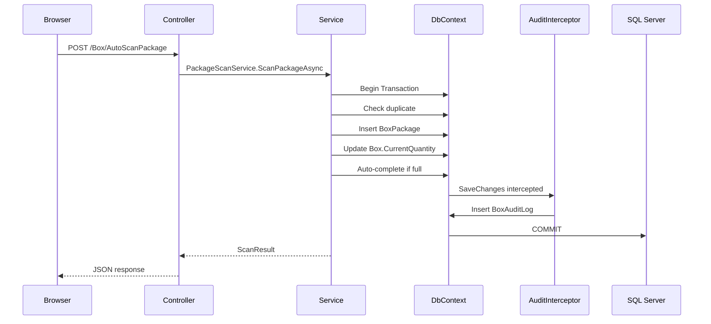

# 03_ARCHITECTURE.md -- Architecture technique

## 1. Vue d'ensemble

Motherson Box Management suit le modele **ASP.NET Core MVC** avec une separation claire entre les controleurs (routage minimal), les services (logique metier) et l'acces aux donnees (EF Core + SQL Server). L'architecture est une **application web monolithique** accompagnee d'une application de bureau PrintAgent (Windows WinForms) utilisee en production pour l'impression d'etiquettes sur les postes de travail de l'usine.



**Source :** `MothersonBoxManagement/Program.cs`, `AGENT.md` lines 26-50

## 2. Structure de la solution

```
Motherson_Box_Management/
├── MothersonBoxManagement/                  # Main ASP.NET Core MVC web app
│   ├── Configuration/                       # DI extension methods (5 files)
│   ├── Controllers/                         # MVC controllers (10 files)
│   ├── Data/                                # DbContext + interceptors
│   │   └── Interceptors/                    # AuditSaveChangesInterceptor
│   ├── Dtos/                                # Data Transfer Objects (10 files)
│   ├── Entities/                            # EF Core entity classes (13 files)
│   ├── Migrations/                          # EF Core migrations (23 files)
│   ├── Models/                              # ViewModels for Razor views (10 files)
│   ├── Printing/                            # PrintAgent service contracts
│   ├── Security/                            # AppRoles constants
│   ├── Services/                            # Business logic services (23 files)
│   ├── Views/                               # Razor views (27 files)
│   ├── wwwroot/                             # Static files (JS, CSS, images)
│   ├── Program.cs                           # Application entry point (140 lines)
│   └── appsettings.json                     # Configuration
├── MothersonBoxManagement.Tests/            # xUnit test suite (25+ files)
├── MothersonBoxManagement.PrintAgent/       # Windows WinForms tray agent
├── MothersonBoxManagement.PrintAgent.Core/  # Shared agent contracts (platform-independent)
├── docs/                                    # Documentation
├── .planning/                               # GSD Core planning artifacts
├── Dockerfile                               # Multi-stage Docker build
├── docker-compose.yml                       # Local dev stack
├── docker-compose.prod.yml                  # Production stack
└── .github/workflows/ci.yml                 # GitHub Actions CI
```

**Source :** Liste des repertoires du depot

## 3. Composants de l'application

### 3.1 Program.cs (Point d'entree)

`Program.cs` fait 140 lignes et configure :
1. Journalisation (console simple, horodatages UTC)
2. Controleurs MVC avec vues
3. Protection des donnees (cles systeme de fichiers, certificat optionnel en production)
4. Antiforgery (nom d'en-tete : X-CSRF-TOKEN)
5. Politiques d'autorisation (`SupervisorOrAdministrator`)
6. DbContext EF Core avec fournisseur SQL Server et `AuditSaveChangesInterceptor`
7. Injection de dependances pour tous les services (16 enregistrements)
8. Limitation de debit (3 politiques : login, scan, globale)
9. Authentification par cookie
10. Pipeline de middleware : Gestionnaire d'exceptions -> HSTS -> Redirection HTTPS -> Fichiers statiques -> Pages de code d'etat -> Limiteur de debit -> En-tetes de securite -> Routage -> Authentification -> Middleware d'auth (redirection MustChangePassword) -> Autorisation
11. Points de sante (`/health/live`, `/health`, `/health/ready`)
12. Initialisation de la base de donnees (auto-migration + seed en Development)

**Source :** `MothersonBoxManagement/Program.cs` (140 lignes)

### 3.2 Extensions de configuration

| Fichier | Responsabilite |
|---------|---------------|
| `AuthenticationConfiguration.cs` | Configuration de l'authentification par cookie, validation du jeton de securite |
| `RateLimitingConfiguration.cs` | Trois politiques de limitation de debit (login, scan, globale) |
| `SecurityHeadersConfiguration.cs` | Middleware CSP, X-Frame-Options, X-Content-Type-Options |
| `DatabaseInitializationExtensions.cs` | Logique d'auto-migration et de seed de demo |
| `ProductionConfigurationValidation.cs` | Validation de la configuration requise en production |

**Source :** Repertoire `MothersonBoxManagement/Configuration/`

### 3.3 Controleurs (10 fichiers)

| Controleur | Type | Responsabilite |
|------------|------|----------------|
| `AccountController` | MVC | Connexion, deconnexion, recuperation de mot de passe |
| `AuditController` | MVC | Visualisation en lecture seule du journal d'audit |
| `BoxController` | MVC | CRUD des boites, scan, recherche, parametres |
| `BoxOperationsController` | MVC | Operations superviseur sur les boites/colis |
| `BoxTemplateController` | MVC | CRUD des modeles |
| `DashboardController` | MVC | Tableau de bord principal, selection de modeles |
| `PrintAgentApiController` | REST API | Appariement du agent d'impression, battements de coeur, cycle de vie des travaux |
| `PrintAgentController` | MVC | Interface de gestion de la flotte d'agents d'impression |
| `PrintController` | MVC | Impression d'etiquettes (serveur + navigateur) |
| `UsersController` | MVC | Gestion des utilisateurs |

**Convention :** Les controleurs sont minimaux. La logique metier est deleguee aux services. Les controleurs gerent le routage, la liaison des ViewModels, la validation des entrees et le rendu des reponses.

**Source :** Repertoire `MothersonBoxManagement/Controllers/`

### 3.4 Couche de services (12+ services)

| Service | Interface(s) | Responsabilite |
|---------|-------------|----------------|
| `BoxService` | `IBoxService`, `IBoxQueryService`, `IBoxLifecycleService`, `IBoxPackageService` | Cycle de vie des boites, requetes, mutations |
| `PackageScanService` | `IPackageScanService` | Scan atomique de colis avec idempotence |
| `BoxTemplateService` | `IBoxTemplateService` | CRUD des modeles, creation de boites a partir d'un modele |
| `AuthenticationService` | `IUserAuthenticationService` | Validation des identifiants |
| `UserService` | `IUserService` | CRUD des utilisateurs avec protections de securite |
| `AuditService` | `IAuditService` | Requetes sur le journal d'audit et enregistrement des rejets |
| `BarcodeService` | `IBarcodeService` | Generation, validation et classification de codes-barres |
| `QrCodeService` | `IQrCodeService` | Generation de QR codes en PNG |
| `WorkstationResolver` | `IWorkstationResolver` | Chaine de resolution du nom de poste de travail |
| `LoginLockoutService` | `ILoginLockoutService` | Verrouillage en cas de force brute (en memoire) |
| `PasswordRecoveryService` | `IPasswordRecoveryService` | Flux de reinitialisation de mot de passe |
| `PrintAgentService` | `IPrintAgentService` | Gestion des travaux d'impression |

**Convention :** Tous les services utilisent l'injection de dependances par constructeur. Toutes les operations I/O sont `async/await` avec `CancellationToken`. La logique metier, la validation, les transactions SQL et la gestion d'etat sont dans les services, pas dans les controleurs.

**Source :** Repertoire `MothersonBoxManagement/Services/`

### 3.5 Couche d'acces aux donnees

- **DbContext :** `ApplicationDbContext` avec 11 proprietes `DbSet`
- **Intercepteur :** `AuditSaveChangesInterceptor` genere automatiquement des enregistrements `BoxAuditLog` a chaque `SaveChanges`
- **DTOs :** 10 classes DTO pour le transfert de donnees entre les couches
- **Mappeur :** `BoxMapper` avec `Expression<Func<Box, BoxDetailsDto>>` compilee pour la traduction SQL EF Core

**Source :** `MothersonBoxManagement/Data/ApplicationDbContext.cs`, `MothersonBoxManagement/Dtos/`

## 4. Pile technologique

| Couche | Technologie | Version | Justification |
|--------|-----------|---------|---------------|
| Runtime | .NET | 8.0 | Version LTS, requise par le projet |
| Framework | ASP.NET Core MVC | 8.0 | Interface web rendue cote serveur, modele standard |
| ORM | Entity Framework Core | 8.0.28 | Migrations Code First, requetes LINQ |
| Base de donnees | SQL Server | 2022-CU15 | Requis pour rowversion, index uniques, contraintes CHECK |
| CSS | Bootstrap | 5.3 | Mise en page responsive, bibliotheque de composants |
| CSS personnalise | site.css | 1491 lignes | Systeme de design Material Design 3 / Corporate Modern |
| QR codes | QRCoder | 1.8.0 | Generation de QR codes en PNG |
| Tests | xUnit | 2.9.3 | Framework de test |
| Tests | WebApplicationFactory | 8.0.28 | Tests d'integration |
| Tests | EF Core InMemory | 8.0.28 | Base de donnees de test |
| CI | GitHub Actions | -- | Build, test, Docker |
| Conteneurisation | Docker | -- | Deploiement reproductible |

**Source :** `MothersonBoxManagement.csproj`, `MothersonBoxManagement.Tests.csproj`, `docker-compose.yml`

## 5. Decisions architecturales (Resume des ADR)

| # | Decision | Rationale | Statut |
|---|----------|-----------|--------|
| 1 | Tables uniques pour Boxes et Packages | Recherche plus facile, indexation, rapports globaux | Valide |
| 2 | Auth par cookie sans ASP.NET Identity | Plus leger, aligne sur l'identification par matricule | Valide |
| 3 | Intercepteur EF Core pour l'audit | Centralise l'audit dans SaveChanges, aucune modification n'echappe a la journalisation | Valide |
| 4 | Separation de BoxController en BoxController + BoxOperationsController | Separation des responsabilites (lecture vs. ecriture) | Valide |
| 5 | Constantes de roles centralisees (AppRoles) | Source unique de verite, evite les fautes de frappe | Valide |
| 6 | WorkstationResolver partage | Principe DRY pour la resolution du poste de travail | Valide |
| 7 | Expression BoxMapper partagee | Projection DTO coherente, traduction SQL EF Core | Valide |
| 8 | Audit consolide uniquement dans l'intercepteur | Elimine les appels explicites redondants a AuditService | Valide |
| 9 | DateTime.UtcNow partout | Horodatages UTC coherents evitent les bugs de fuseau horaire | Valide |
| 10 | Verrouillage en memoire contre la force brute | Suffisant pour une application interne, evite la surcharge de migration DB | Valide |
| 11 | Limitation de debit integree a ASP.NET Core | Aucune nouvelle dependance necessaire | Valide |
| 12 | Deconnexion en POST avec antiforgery | Mitigation CSRF | Valide |
| 13 | Redirection HTTPS conditionnelle | Preserve la compatibilite des tests tout en imposant HTTPS en production | Valide |
| 14 | Chemin de release local dockerise | Demarrage reproductible pour la demo et la validation | Valide |
| 15 | Identite de poste locale au navigateur | Deploiement serveur partage, les terminaux s'identifient eux-memes | Valide |
| 16 | Creation de boites basee sur des modeles | Creation standardisee tout en maintenant la tracabilite du double scan | Valide |
| 17 | Auto-scan avec prefixe de modele | Flux de travail plus rapide pour les modeles de colis connus | Valide |
| 18 | Mode boite collant | Scan continu sans re-scanner la boite | Valide |

**Source :** `AGENT.md` lines 240-267

## 6. Diagramme de communication des composants



**Source :** `PackageScanService.cs`, `AuditSaveChangesInterceptor.cs`
