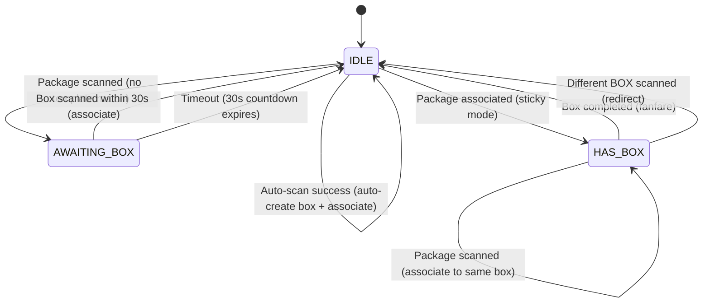

# 04_FRONTEND.md -- Analyse du frontend

## 1. Vue d'ensemble technologique

| Aspect | Technologie |
|--------|-----------|
| Rendu | Vues Razor cote serveur (.cshtml) |
| Framework UI | Bootstrap 5.3 (CDN) |
| CSS personnalise | `site.css` (1491 lignes, tokens Material Design 3) |
| JavaScript | Vanilla JS (aucun framework), 3 fichiers |
| Polices | Inter (Google Fonts CDN) |
| Icones | SVG inline (aucune bibliotheque d'icones) |
| Interactivite | Amelioration progressive (JS ameliore le HTML rendu par le serveur) |

**Source :** `MothersonBoxManagement/Views/Shared/_Layout.cshtml`, `MothersonBoxManagement/wwwroot/`

## 2. Systeme de design

Le design suit les principes **Corporate Modern / Material Design 3** definis dans `DESIGN.md`.

### 2.1 Palette de couleurs

| Jeton | Hex | Utilisation |
|-------|-----|-------------|
| Primary | `#E51E25` (Motherson Red) | Actions primaires, alertes critiques |
| Surface | `#F8F9FB` | Arriere-plan principal |
| On-Surface | `#191C1E` | Texte du corps |
| Error | `#BA1A1A` | Etats d'erreur |
| Status Open | `#16A34A` (vert) | Badges boite ouverte |
| Status Completed | `#DC2626` (rouge) | Badges boite terminee |
| Status Exception | `#0284C7` (bleu) | Badges boite en exception |
| Status Blocked | `#D97706` (ambre) | Badges boite bloquee |
| Status Archived | `#6B7280` (gris) | Badges boite archivee |

**Source :** `MothersonBoxManagement/wwwroot/css/site.css`, `DESIGN.md`

### 2.2 Typographie

- **Famille de polices :** Inter (tout le texte)
- **Echelle :** Display LG (36px) -> Headline LG (28px) -> Headline MD (20px) -> Body LG (16px) -> Body MD (14px) -> Label LG (14px semibold) -> Label MD (12px medium)

**Source :** `DESIGN.md` lines 51-93

### 2.3 Mise en page

- **Desktop (>= 1200px) :** Barre laterale fixe (260px) + zone de contenu principal
- **Tablette (768-1199px) :** Barre laterale reduite (hors canvas avec superposition)
- **Mobile (< 768px) :** Menu hamburger, composants empiles
- **Grille :** Grille Bootstrap 12 colonnes, gouttieres 24px, marges 32px
- **Espacement :** Grille de base 4px (xs=8, sm=12, md=16, lg=24, xl=32)

**Source :** Points de reponse responsive de `site.css`, `DESIGN.md` lines 136-140

## 3. Inventaire des fichiers

### 3.1 Vues (27 fichiers .cshtml)

| # | Fichier | Lignes | But |
|---|---------|--------|-----|
| 1 | `Shared/_Layout.cshtml` | 196 | Mise en page principale (barre laterale, en-tete, scripts) |
| 2 | `Shared/_ValidationScriptsPartial.cshtml` | 3 | Scripts de validation jQuery |
| 3 | `Shared/Error.cshtml` | 38 | Page d'erreur (440, generique) |
| 4 | `Shared/Components/PasswordResetNotification/Default.cshtml` | 9 | Badge admin pour les reinitialisations en attente |
| 5 | `Dashboard/Index.cshtml` | 374 | Tableau de bord principal |
| 6 | `Dashboard/Templates.cshtml` | 106 | Selection de modeles pour la creation de boites |
| 7 | `Box/Index.cshtml` | 190 | Recherche et suivi des boites |
| 8 | `Box/Details.cshtml` | 654 | Vue detaillee de la boite (la plus complexe) |
| 9 | `Box/SearchPackage.cshtml` | 26 | Page de recherche de colis |
| 10 | `Box/Settings.cshtml` | 397 | Parametres du poste de travail et de l'agent d'impression |
| 11 | `Box/Print.cshtml` | 146 | Page d'impression d'etiquette (autonome) |
| 12 | `Account/Login.cshtml` | 66 | Formulaire de connexion |
| 13 | `Account/RequestPasswordReset.cshtml` | 24 | Demande de reinitialisation de mot de passe |
| 14 | `Account/RecoveryLogin.cshtml` | 21 | Connexion de recuperation (sans mot de passe) |
| 15 | `Account/ChangePassword.cshtml` | 15 | Changement de mot de passe force |
| 16 | `Audit/Index.cshtml` | 327 | Visualiseur du journal d'audit |
| 17 | `Users/Index.cshtml` | 101 | Liste des utilisateurs |
| 18 | `Users/Create.cshtml` | 67 | Formulaire de creation d'utilisateur |
| 19 | `Users/Edit.cshtml` | 55 | Formulaire d'edition d'utilisateur |
| 20 | `Users/ResetPassword.cshtml` | 51 | Reinitialisation de mot de passe par l'admin |
| 21 | `Users/PasswordResetRequests.cshtml` | 64 | Demandes de reinitialisation en attente |
| 22 | `BoxTemplate/Index.cshtml` | 128 | Liste des modeles |
| 23 | `BoxTemplate/Create.cshtml` | 194 | Formulaire de creation de modele |
| 24 | `BoxTemplate/Edit.cshtml` | 153 | Formulaire d'edition de modele |
| 25 | `PrintAgent/Workstations.cshtml` | 88 | Gestion de la flotte de postes de travail |

**Source :** Repertoire `MothersonBoxManagement/Views/`

### 3.2 Fichiers JavaScript (3 fichiers)

| Fichier | Lignes | But |
|---------|--------|-----|
| `scanner.js` | 438 | Machine a etats globale du scanner de codes-barres (IDLE, AWAITING_BOX, HAS_BOX) |
| `station-terminal.js` | 99 | Gestion du nom du poste via localStorage |
| `adaptive-pagination.js` | 33 | Calcul automatique de la taille de page basee sur la hauteur du viewport |

**Source :** Repertoire `MothersonBoxManagement/wwwroot/js/`

### 3.3 CSS (1 fichier)

| Fichier | Lignes | But |
|---------|--------|-----|
| `site.css` | 1491 | Systeme de design complet (tokens, composants, responsive) |

**Source :** `MothersonBoxManagement/wwwroot/css/site.css`

## 4. Tableau des routes/pages

| Route | Vue | Roles | But | Statut |
|-------|-----|-------|-----|--------|
| `GET /Account/Login` | Login.cshtml | Anonyme | Formulaire de connexion | :green_circle: |
| `POST /Account/Login` | (redirection) | Anonyme | Authentifier | :green_circle: |
| `GET /Account/RequestPasswordReset` | RequestPasswordReset.cshtml | Anonyme | Demander une reinitialisation | :green_circle: |
| `GET /Account/RecoveryLogin` | RecoveryLogin.cshtml | Anonyme | Connexion de recuperation | :green_circle: |
| `GET /Account/ChangePassword` | ChangePassword.cshtml | Autorise | Changement de mot de passe force | :green_circle: |
| `POST /Account/Logout` | (redirection) | Autorise | Deconnexion | :green_circle: |
| `GET /Dashboard` | Index.cshtml | Autorise | Tableau de bord principal | :green_circle: |
| `GET /Dashboard/Templates` | Templates.cshtml | Autorise | Selection de modeles | :green_circle: |
| `GET /Box` | Index.cshtml | Autorise | Recherche/liste de boites | :green_circle: |
| `GET /Box/Details/{barcode}` | Details.cshtml | Autorise | Details de la boite | :green_circle: |
| `GET /Box/SearchPackage` | SearchPackage.cshtml | Autorise | Recherche de colis | :green_circle: |
| `GET /Box/Settings` | Settings.cshtml | Autorise | Parametres du poste | :green_circle: |
| `GET /Box/Print/{barcode}` | Print.cshtml | Superviseur/Admin | Impression serveur d'etiquette | :green_circle: |
| `GET /Box/PrintClient/{barcode}` | Print.cshtml | Autorise | Impression navigateur d'etiquette | :green_circle: |
| `GET /Audit` | Index.cshtml | Superviseur/Admin | Journal d'audit | :green_circle: |
| `GET /Users` | Index.cshtml | Admin | Liste des utilisateurs | :green_circle: |
| `GET /Users/Create` | Create.cshtml | Admin | Creer un utilisateur | :green_circle: |
| `GET /Users/Edit/{id}` | Edit.cshtml | Admin | Editer un utilisateur | :green_circle: |
| `GET /Users/ResetPassword/{id}` | ResetPassword.cshtml | Admin | Reinitialiser le mot de passe | :green_circle: |
| `GET /Users/PasswordResetRequests` | PasswordResetRequests.cshtml | Admin | Reinitialisations en attente | :green_circle: |
| `GET /BoxTemplate` | Index.cshtml | Superviseur/Admin | Liste des modeles | :green_circle: |
| `GET /BoxTemplate/Create` | Create.cshtml | Superviseur/Admin | Creer un modele | :green_circle: |
| `GET /BoxTemplate/Edit/{id}` | Edit.cshtml | Superviseur/Admin | Editer un modele | :green_circle: |
| `GET /PrintAgent/Workstations` | Workstations.cshtml | Admin | Flotte de postes | :green_circle: |

**Source :** Toutes les methodes d'action des controleurs avec attributs `[Authorize]`

## 5. Machine a etats du scanner (scanner.js)

Le scanner est la fonctionnalite interactive principale. Il implemente une machine a 3 etats pour le scan de codes-barres :

### Details des etats

| Etat | Entree du scanner | Action |
|------|------------------|--------|
| **IDLE** | Code-barres BOX | Redirection vers `/Box/Details/{barcode}` |
| **IDLE** | Code-barres colis | Essai `POST /Box/AutoScanPackage`. Si aucune correspondance, entre dans AWAITING_BOX |
| **AWAITING_BOX** | Code-barres BOX | `POST /Box/AssociatePackage`, entre dans HAS_BOX |
| **AWAITING_BOX** | Code-barres colis | Erreur : "Scan a box barcode next" |
| **AWAITING_BOX** | Expiration 30s | Efface le scan en attente, retour a IDLE |
| **HAS_BOX** | Code-barres colis | `POST /Box/AssociatePackage` (collant, meme boite) |
| **HAS_BOX** | Code-barres BOX | Redirection vers les details de la nouvelle boite, quitte le mode collant |
| **HAS_BOX** | Boite pleine | Joue la fanfare (4 notes ascendantes), retour a IDLE |

### Retour sonore

| Evenement | Son | Frequence |
|-----------|-----|-----------|
| Colis detecte | Deux tons ascendants | 900Hz + 1100Hz |
| Succes | Trois tons ascendants | 700Hz + 900Hz + 1100Hz |
| Erreur | Bourdonnement brutal | Carre 250Hz, 0.25s |
| Expiration | Trois tons descendants | 500Hz + 350Hz + 200Hz |
| Boite pleine | Quatre tons ascendants (C5-C6) | 523Hz + 659Hz + 784Hz + 1047Hz |

Le son peut etre mis en sourdine via `localStorage.mothersonScannerSound = 'off'`.

**Source :** `MothersonBoxManagement/wwwroot/js/scanner.js` (438 lignes)

## 6. Systeme de terminal de poste (station-terminal.js)

- **Cle de stockage :** `motherson.stationName` dans localStorage
- **Comportement :** Injecte automatiquement un champ cache `workstationName` dans chaque formulaire POST
- **Normalisation :** Supprime les espaces, remplace les espaces internes par des tirets, max 64 caracteres
- **API globale :** `window.MothersonStation.appendToFormData()`, `.getStationName()`, `.setStationName()`

**Source :** `MothersonBoxManagement/wwwroot/js/station-terminal.js` (99 lignes)

## 7. Pagination adaptive (adaptive-pagination.js)

- Trouve les tables avec l'attribut `[data-adaptive-pagination]`
- Calcule la taille de page optimale a partir de la hauteur du viewport
- Formule : `Math.floor((window.innerHeight - tableTop - 120px) / rowHeight)`
- Limitee entre [5, 100], met a jour le parametre d'URL au redimensionnement (debounce 250ms)

**Source :** `MothersonBoxManagement/wwwroot/js/adaptive-pagination.js` (33 lignes)

## 8. Composants UI cles

### 8.1 Navigation laterale

- Barre laterale fixe de 260px sur desktop, retractable a 70px (icones uniquement)
- Hors canvas avec superposition sur mobile (< 1200px)
- Quatre sections : Operations, Configuration, Supervision, Administration
- Visibilite du menu basee sur les roles (cotes serveur, verifications `User.IsInRole()`)
- Indicateur d'etat du scanner (point vert = pret, jaune = pause)
- Carte d'identite utilisateur (nom + role) en bas

**Source :** `MothersonBoxManagement/Views/Shared/_Layout.cshtml`

### 8.2 Superpositions du scanner

Superpositions plein ecran (z-index : 99999) avec flou d'arriere-plan :
- **info** (accent rouge) : Colis detecte, en attente du scan de la boite, compte a rebours de 30s
- **success** (accent vert) : Colis lie, avec metriques et barre de progression
- **error** (accent rouge) : Scan rejete, necessite un acquittement
- **warning** (accent ambre) : Delai expire
- **redirect** (accent bleu) : Boite detectee, navigation en cours

**Source :** `scanner.js`, `site.css`

### 8.3 Page de details de la boite (Vue la plus complexe)

654 lignes avec :
- Carte des specifications de la boite (numero, statut, type, dimensions, barre de progression)
- Table des colis scannes (avec actions superviseur par colis)
- 6 modals au niveau de la boite (Modifier quantite, Annuler, Fermer avec force, Bloquer, Debloquer, Archiver)
- 6 modals par colis (Transferer, Retirer, Bloquer, Debloquer, Dissocier)
- Tous les modals incluent un jeton CSRF et une zone de texte pour le motif obligatoire

**Source :** `MothersonBoxManagement/Views/Box/Details.cshtml` (654 lignes)

### 8.4 Badges de statut

Badges codes par couleur pour toutes les valeurs de `BoxStatus` :
- Open : vert
- Completed : rouge
- CompletedWithException : bleu
- Cancelled : rouge
- Blocked : ambre
- Archived : gris
- Created : (par defaut)

**Source :** Classes badge-status de `site.css`

## 9. Parcours utilisateurs

### 9.1 Operateur : Scanner un colis dans une boite

1. Connexion a `/Account/Login`
2. Le tableau de bord se charge avec les boites actives
3. Scan du code-barres du colis (scanner.js capture depuis le champ cache)
4. L'auto-scan verifie les prefixes des modeles
5. Si correspondance : boite auto-creee, colis associe, redirection vers PrintClient
6. Si aucune correspondance : entre dans l'etat AWAITING_BOX, scanner le code-barres de la boite dans les 30s
7. Colis associe, entre en mode collant
8. Continuer a scanner les colis jusqu'a ce que la boite soit pleine
9. Fanfare de completion de la boite, retour a IDLE

### 9.2 Superviseur : Gerer une exception

1. Naviguer vers les details de la boite (`/Box/Details/{barcode}`)
2. Cliquer sur "Fermer avec exception" dans le centre de controle superviseur
3. Entrer le motif dans la zone de texte du modal
4. POST vers `/Box/ForceCloseBox`
5. Le statut de la boite change en CompletedWithException
6. Le journal d'audit enregistre l'action avec le motif

### 9.3 Administrateur : Gerer les utilisateurs

1. Naviguer vers `/Users`
2. Creer un nouvel utilisateur (matricule, nom complet, role, mot de passe)
3. Ou editer un utilisateur existant, reinitialiser le mot de passe, desactiver
4. Approuver les demandes de reinitialisation a `/Users/PasswordResetRequests`

**Source :** Flux d'actions des controleurs, structures des vues
