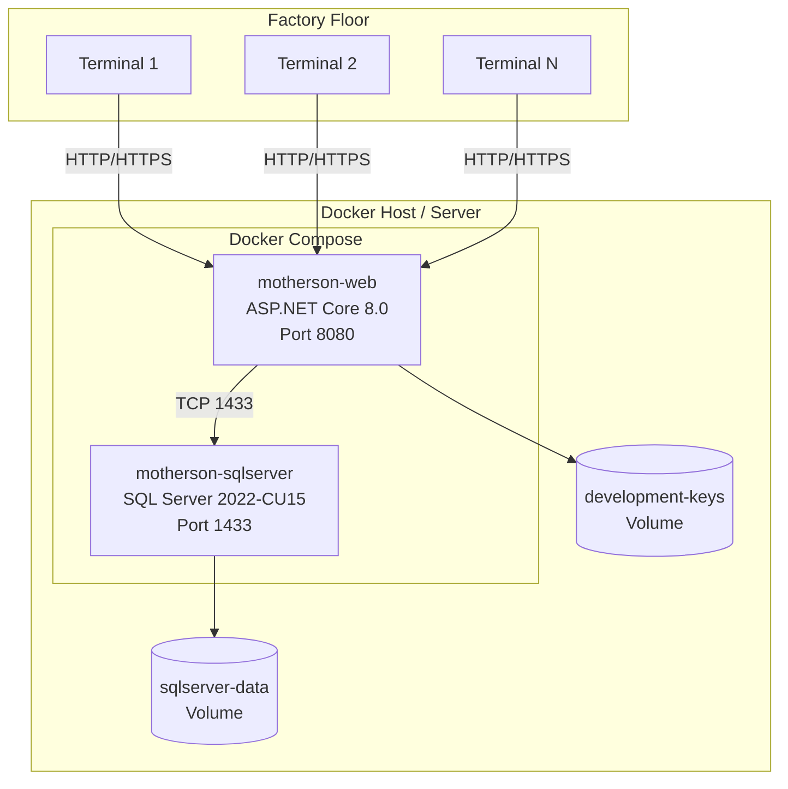

# 08_INFRASTRUCTURE_AND_DEPLOYMENT.md -- Infrastructure et Deploiement

## 1. Architecture de deploiement



**Source :** `docker-compose.yml`, `Dockerfile`

## 2. Configuration Docker

### 2.1 Dockerfile (build multi-etape)

**Etape 1 : Build**
- Base : `mcr.microsoft.com/dotnet/sdk:8.0.422`
- Restaure les paquets NuGet pour toute la solution
- Publie le projet web en configuration Release

**Etape 2 : Runtime**
- Base : `mcr.microsoft.com/dotnet/aspnet:8.0.28`
- Installe `curl` pour les verifications de sante
- Cree le repertoire `/keys` pour la Protection des donnees
- Expose le port 8443
- Verification de sante : `curl --fail --silent --show-error --insecure https://localhost:8443/health/ready`
- Execute en tant qu'utilisateur non-root (`$APP_UID`)

**Source :** `Dockerfile` (33 lignes)

### 2.2 docker-compose.yml (Developpement)

| Service | Image | Port | Verification de sante |
|---------|-------|------|----------------------|
| `sqlserver` | `mcr.microsoft.com/mssql/server:2022-CU15-ubuntu-22.04` | `${MOTHERSON_SQL_PORT:-1433}:1433` | `sqlcmd -Q "SELECT 1"` toutes les 10s |
| `web` | Construit depuis le Dockerfile | `${MOTHERSON_APP_PORT}:8080` | `curl http://localhost:8080/health/ready` toutes les 15s |

**Variables d'environnement (web) :**
- `ASPNETCORE_ENVIRONMENT=Development`
- `WorkstationName` depuis `${MOTHERSON_WORKSTATION}`
- `DemoUsers__OP001__Password` (requis)
- `DemoUsers__SP001__Password` (requis)
- `DemoUsers__AD001__Password` (requis)
- `ConnectionStrings__DefaultConnection` (auto-configure pour le conteneur SQL Server)
- `DataProtection__KeyPath=/keys`

**Volumes :** `sqlserver-data` (BD persistante), `development-keys` (cles de Protection des donnees)

**Source :** `docker-compose.yml` (50 lignes)

### 2.3 docker-compose.prod.yml (Production)

- `ASPNETCORE_ENVIRONMENT=Production`
- HTTPS sur le port 8443
- Requiert : certificat TLS PFX, certificat de Protection des donnees PFX, AllowedHosts, identifiants BD
- Auto-migration et seeding des utilisateurs de demo desactives
- Rotation des journaux : 10 Mo max, 5 fichiers
- Toutes les valeurs sensibles sont des variables d'environnement requises (echec rapide si manquantes)

**Source :** `docker-compose.prod.yml`

## 3. Variables d'environnement

### 3.1 Variables requises

| Variable | Objectif | Exemple |
|----------|----------|---------|
| `MSSQL_SA_PASSWORD` | Mot de passe SA SQL Server | `[REDACTED]` |
| `MOTHERSON_DB_NAME` | Nom de la base de donnees | `MothersonBoxDb` |
| `MOTHERSON_APP_PORT` | Port hote de l'application web | `8080` |
| `MOTHERSON_SQL_PORT` | Port hote SQL Server | `11433` |
| `MOTHERSON_WORKSTATION` | Nom du poste par defaut | `DOCKER-STATION-01` |
| `DEMO_OP001_PASSWORD` | Mot de passe seed operateur | `[REDACTED]` |
| `DEMO_SP001_PASSWORD` | Mot de passe seed superviseur | `[REDACTED]` |
| `DEMO_AD001_PASSWORD` | Mot de passe seed admin | `[REDACTED]` |

### 3.2 Variables specifiques a la production

| Variable | Objectif |
|----------|----------|
| `MOTHERSON_ALLOWED_HOSTS` | Noms d'hotes autorises |
| `MOTHERSON_DB_HOST` | Nom d'hote SQL Server |
| `MOTHERSON_DB_PORT` | Port SQL Server |
| `MOTHERSON_DB_APP_USER` | Utilisateur BD a privilege minimal |
| `MOTHERSON_DB_APP_PASSWORD` | Mot de passe utilisateur BD |
| `MOTHERSON_DB_TRUST_CERTIFICATE` | Faire confiance au certificat SQL Server |
| `MOTHERSON_HTTPS_PORT` | Port HTTPS |
| `MOTHERSON_TLS_CERT_PATH` | Chemin du certificat TLS PFX |
| `MOTHERSON_TLS_CERT_PASSWORD` | Mot de passe du certificat TLS |
| `MOTHERSON_DP_CERT_PATH` | Chemin du certificat de Protection des donnees |
| `MOTHERSON_DP_CERT_PASSWORD` | Mot de passe du certificat de Protection des donnees |

### 3.3 Variables de configuration applicative

| Variable | Objectif | Par defaut |
|----------|----------|------------|
| `ConnectionStrings__DefaultConnection` | Chaine de connexion SQL Server | (vide) |
| `Authentication__CookieName` | Nom du cookie de session | `Motherson.BoxManagement.Auth` |
| `Authentication__ExpireTimeSpanMinutes` | Duree de vie de la session | `60` |
| `Database__AutoMigrate` | Auto-migration en non-Dev | `false` |
| `SeedDemoUsers` | Seeding des comptes de demo | `false` (true en Dev) |
| `Security__LoginLockout__MaxAttempts` | Seuil de verrouillage | `5` |
| `Security__LoginLockout__LockoutMinutes` | Duree de verrouillage | `15` |
| `WorkstationName` | Nom du poste par defaut | `DEFAULT-STATION` |
| `DataProtection__KeyPath` | Chemin de stockage des cles | (optionnel) |
| `DataProtection__CertificatePath` | Certificat de chiffrement des cles | (optionnel, prod) |

**Source :** `.env.example`, `appsettings.json`, `AGENT.md` lignes 203-211

## 4. Points de terminaison de sante

| Point de terminaison | Objectif | Auth | Reponse |
|----------------------|----------|------|---------|
| `GET /health/live` | Sonde de vivacite | Anonyme | `200 OK` avec `{ status: "Healthy" }` |
| `GET /health` | Sonde de preparation | Anonyme | `200 OK` si la BD se connecte, `503` sinon |
| `GET /health/ready` | Sonde de preparation (alias) | Anonyme | Identique a `/health` |

**Source :** `Program.cs` lignes 120-136

## 5. Pipeline CI/CD

### 5.1 GitHub Actions (`.github/workflows/ci.yml`)

**Declencheur :** Push et Pull Request

**Travaux :**

| Travail | Execute sur | Objectif |
|---------|-------------|----------|
| `build-test` | windows-latest, ubuntu-latest | Checkout, configuration .NET 8.0.x, restauration, build, test avec couverture, porte vulnerabilite NuGet, publication |
| `sql-integration` | ubuntu-latest | Conteneur de service SQL Server 2022, execute `SqlServerIntegrationTests` |
| `package-print-agent` | windows-latest | Construit l'EXE autonome PrintAgent, telecharge l'artefact |
| `docker-build` | ubuntu-latest | Construit l'image Docker, verifie l'existence |

**Source :** `.github/workflows/ci.yml`

### 5.2 Notes CI

- Le travail `package-print-agent` reference la fonctionnalite PrintAgent qui a ensuite ete remplacee par l'impression navigateur uniquement. Le CI peut etre obsolete.
- Aucun test de fumee Docker Compose ni verification de point de sante dans le CI.
- Aucune validation du compose de production dans le CI.

**Source :** `docs/production-readiness-audit/06-DEPLOYMENT-READINESS.md`

## 6. Initialisation de la base de donnees

### 6.1 Mode Developpement

Au demarrage (`Program.cs` ligne 138) :
1. Applique automatiquement les migrations EF Core (`Database.MigrateAsync()`)
2. Seed les utilisateurs de demo si `SeedDemoUsers=true` (OP001, SP001, AD001)
3. Seed le principal SYSTEM et BarcodeConfiguration

### 6.2 Mode Production

- Auto-migration desactivee sauf si `Database__AutoMigrate=true`
- Seeding de demo desactive sauf si `SeedDemoUsers=true`
- Migration manuelle : `dotnet ef database update`

**Source :** `MothersonBoxManagement/Configuration/DatabaseInitializationExtensions.cs`

## 7. Topologie de deploiement

### 7.1 Actuel (Docker Local)

```
Docker Host
├── motherson-web (ASP.NET Core, port 8080)
└── motherson-sqlserver (SQL Server, port 1433/11433)
```

### 7.2 Production (docker-compose.prod.yml)

```
Serveur de production
├── motherson-web (ASP.NET Core, HTTPS port 8443)
└── SQL Server externe (utilisateur a privilege minimal, pas sa)
```

### 7.3 Print Agent (Separe)

```
Poste de travail usine
└── MothersonPrintAgent.exe (barre des taches WinForms, se connecte a l'API web via HTTPS)
```

**Source :** `docker-compose.yml`, `docker-compose.prod.yml`, projet PrintAgent

## 8. Problemes d'infrastructure connus

| Probleme | Description | Source |
|----------|-------------|--------|
| Incoherence de verification de sante | Dockerfile HTTPS/8443 vs compose HTTP/8080 | production-readiness-audit |
| Pas de travail de migration | Pas de conteneur d'init separe pour les migrations | production-readiness-audit |
| Sauvegarde/restauration | Non valide sur l'infrastructure cible | production-readiness-audit |
| Chaine d'approvisionnement | Pas de SBOM, pas de signature d'image | production-readiness-audit |
| Supervision | Pas de Prometheus/Grafana/ELK configure | production-readiness-audit |
